# GraphReFly Rust Port Flowcharts

*Mermaid diagrams covering the Rust port's distinctive shape: workspace layout, the handle-protocol cleaving plane, lock discipline, RAII patterns, wave-engine state machine, and Graph container — all for the surface that's actually landed.*

**Companion docs:**
- `~/src/graphrefly-ts/docs/implementation-plan-13.6-canonical-spec.md` — canonical spec rules `R<x.y.z>`.
- `~/src/graphrefly-ts/docs/implementation-plan-13.6-flowcharts.md` — TS-side spec flowcharts. Read those for *protocol semantics*; read this for *Rust shape*.
- `migration-status.md` — slice-by-slice landed/deferred record.
- `porting-deferred.md` — known v1 limitations.

**Slice coverage:** A → A-bigger → A close → B → C → C-1 → C-1.5 → C-2 → D → E+ → F (M2 close).

**Conventions:**
- Solid arrow → control flow. Dashed arrow → data/message flow. Dotted arrow → optional/conditional path.
- Decision diamonds use the `{}` shape with a question.
- 🟨 **YELLOW** flags v1 limitations / documented divergences from canonical spec (lifts in a later slice).
- 🟦 **BLUE** flags Rust-specific simplifications versus TS (no protocol meaning; just port shape).
- Method names match the source. `pub` methods omit prefix; `pub(crate)` / private methods are noted in their callouts.

---

## Batch 0 — Workspace overview

### 0.1 Crate map

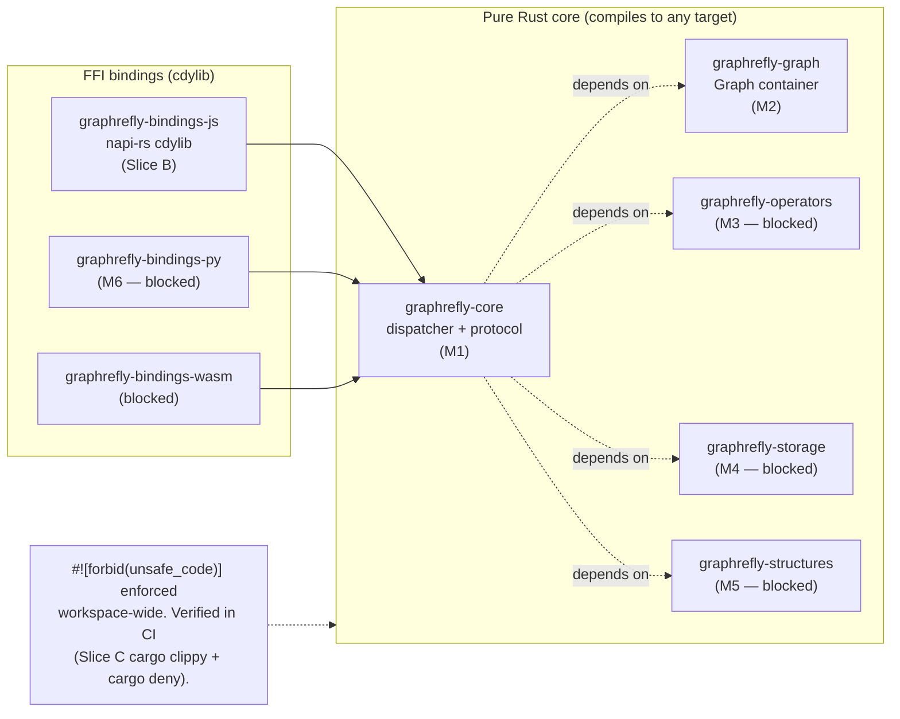

---

### 0.2 Handle-protocol cleaving plane (R6 / Implementation Delta)

The **Core never sees user values `T`**. All payload-bearing messages carry `HandleId(u64)`. The binding side owns the handle→value registry; identity-equals is a pure `u64` compare with zero FFI.

```mermaid
flowchart TB
    subgraph Binding["Binding side (graphrefly-bindings-js / -py / -wasm)"]
        Registry["HandleId → T registry<br/>(Map&lt;HandleId, &#123; value, refcount &#125;&gt;)"]
        Intern["intern(value) → HandleId"]
        Resolve["resolve(handle) → T"]
        UserFn["user fn body (T-typed)"]
    end

    subgraph Boundary["BindingBoundary trait (Send + Sync)"]
        invoke["invoke_fn(node_id, fn_id, &amp;[HandleId]) → FnResult"]
        equals["custom_equals(equals_id, a, b) → bool"]
        retain["retain_handle(h)"]
        release["release_handle(h)"]
    end

    subgraph Core["Core (graphrefly-core)"]
        cache["cache: HandleId<br/>(NO_HANDLE = sentinel)"]
        dispatcher["dispatcher logic<br/>(zero T awareness)"]
        identityEq["EqualsMode::Identity<br/>= u64 compare<br/>(zero FFI)"]
    end

    UserFn -. emit DATA(value) .-> Intern
    Intern --> Registry
    Intern -. handle .-> Core
    dispatcher -.-> invoke
    invoke -.-> Registry
    Registry -.-> UserFn
    UserFn -.-> invoke
    dispatcher -.-> retain
    dispatcher -.-> release
    retain -.-> Registry
    release -.-> Registry
    dispatcher --> identityEq
    dispatcher -. only when EqualsMode::Custom .-> equals

    note["Performance contract: ONE FFI call per fn fire,<br/>regardless of dep count.<br/>Identity equals never crosses the boundary."]
    note -.-> Core
```

---

### 0.3 Slice progression timeline (M1 → M2 close)

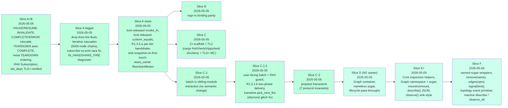

---

## Batch 1 — Core shape & lock discipline

### 1.1 Core / CoreState struct

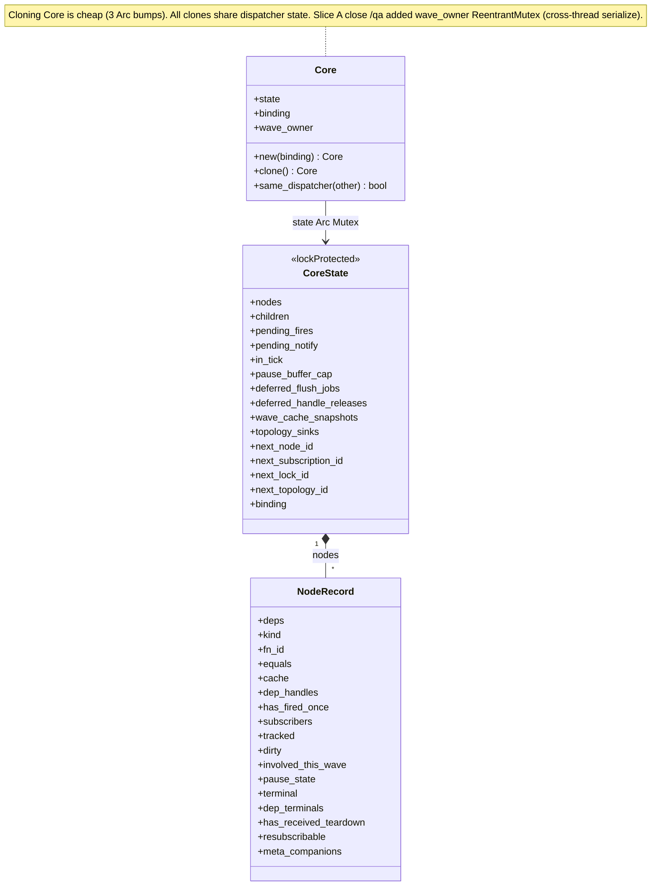

**Field types** (omitted from diagram to avoid Mermaid generic-syntax limitations):

| Class | Field | Type |
|-------|-------|------|
| `Core` | `state` | `Arc<Mutex<CoreState>>` |
| `Core` | `binding` | `Arc<dyn BindingBoundary>` |
| `Core` | `wave_owner` | `Arc<ReentrantMutex<()>>` |
| `CoreState` | `nodes` | `HashMap<NodeId, NodeRecord>` |
| `CoreState` | `children` | `HashMap<NodeId, HashSet<NodeId>>` |
| `CoreState` | `pending_fires` | `HashSet<NodeId>` |
| `CoreState` | `pending_notify` | `IndexMap<NodeId, PendingPerNode>` |
| `CoreState` | `pause_buffer_cap` | `Option<usize>` |
| `CoreState` | `deferred_flush_jobs` | `Vec<(Vec<Sink>, Vec<Message>)>` |
| `CoreState` | `deferred_handle_releases` | `Vec<HandleId>` |
| `CoreState` | `wave_cache_snapshots` | `HashMap<NodeId, HandleId>` |
| `CoreState` | `topology_sinks` | `HashMap<u64, TopologySink>` |
| `NodeRecord` | `deps` | `Vec<NodeId>` |
| `NodeRecord` | `kind` | `NodeKind` (`State` / `Derived` / `Dynamic`) |
| `NodeRecord` | `fn_id` | `Option<FnId>` |
| `NodeRecord` | `equals` | `EqualsMode` |
| `NodeRecord` | `cache` | `HandleId` |
| `NodeRecord` | `dep_handles` | `Vec<HandleId>` |
| `NodeRecord` | `subscribers` | `HashMap<SubscriptionId, Sink>` |
| `NodeRecord` | `tracked` | `HashSet<usize>` |
| `NodeRecord` | `pause_state` | `PauseState` |
| `NodeRecord` | `terminal` | `Option<TerminalKind>` |
| `NodeRecord` | `dep_terminals` | `Vec<Option<TerminalKind>>` |
| `NodeRecord` | `meta_companions` | `Vec<NodeId>` |

🟦 The **wave_owner re-entrant mutex** is Rust-specific. TS is single-threaded; PY is GIL-serialized; Rust is the first impl with parallel access. Acquired in `begin_batch` BEFORE the state lock — same-thread re-entry passes through, cross-thread emits block.

---

### 1.2 PauseState enum (Slice A+B simplification)

🟦 Replaces the four TS fields (`_pauseLocks`, `_pauseBuffer`, `_pauseDroppedCount`, `_pauseStartNs`) with a single enum where buffered fields are unreachable in `Active`. Compiler-enforced "Active ⟹ no buffer."

```mermaid
stateDiagram-v2
    [*] --> Active: node constructed
    Active --> Paused: add_lock(L1)<br/>(first lock; record started_at_ns)
    Paused --> Paused: add_lock(L2)<br/>(idempotent on duplicate)
    Paused --> Paused: remove_lock(unknown)<br/>no-op (R1.3.8.f)
    Paused --> Paused: remove_lock(Lk)<br/>locks.len() &gt; 1
    Paused --> Active: remove_lock(last)<br/>return (buffer, dropped)
    Paused --> Paused: push_buffered(msg, cap)<br/>tier 3+4 only
    Active --> [*]: Drop
    Paused --> [*]: Drop<br/>(Drop for CoreState releases<br/>buffer payload retains)

    note right of Paused
        struct fields:
        - locks: SmallVec&lt;[LockId; 2]&gt;
        - buffer: VecDeque&lt;Message&gt;
        - dropped: u32
        - started_at_ns: u64
        Cap overflow drops oldest.
    end note
```

---

### 1.3 Lock discipline progression (Slice A → A close)

The single largest port-shape evolution. Rust started with TS's "lock-held everywhere" shape; each slice lifted one binding-callback site to lock-released.

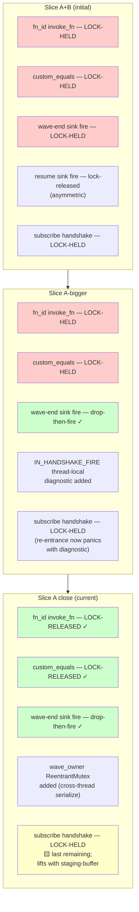

---

### 1.4 IN_HANDSHAKE_FIRE thread-local diagnostic

Subscribe-time handshake fires under the state lock (race-fix discipline). A handshake-time sink callback that re-enters Core would deadlock. The diagnostic turns deadlock into a clear panic.

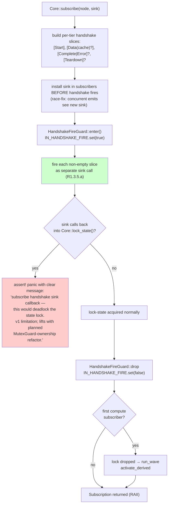

---

## Batch 2 — Wave engine

### 2.1 `run_wave` / `begin_batch` RAII flow (Slice C-1.5 / Slice A close /qa Q2)

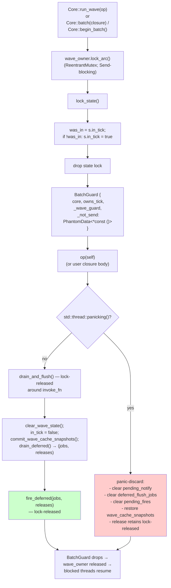

🟦 `BatchGuard` is `!Send` — `compile_fail` doctest enforces. Sending across threads would clear `in_tick` from a thread that didn't set it, and `parking_lot::ReentrantMutex` requires same-thread release.

---

### 2.2 `fire_fn` three-phase (Slice A close lock-released `invoke_fn`)

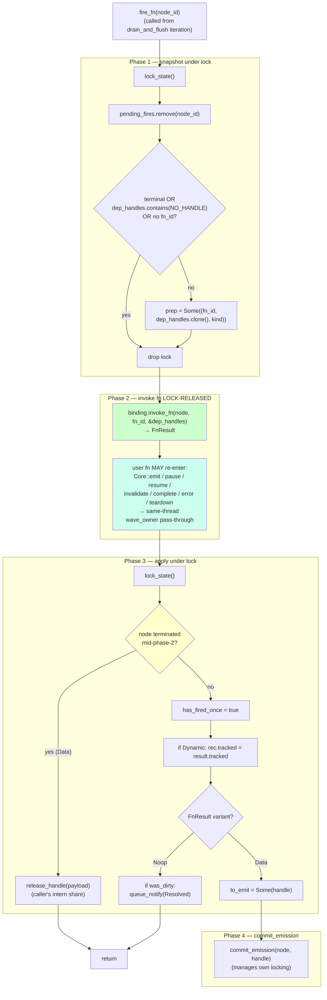

---

### 2.3 `commit_emission` with lock-released `custom_equals` + cache-race fix (P3)

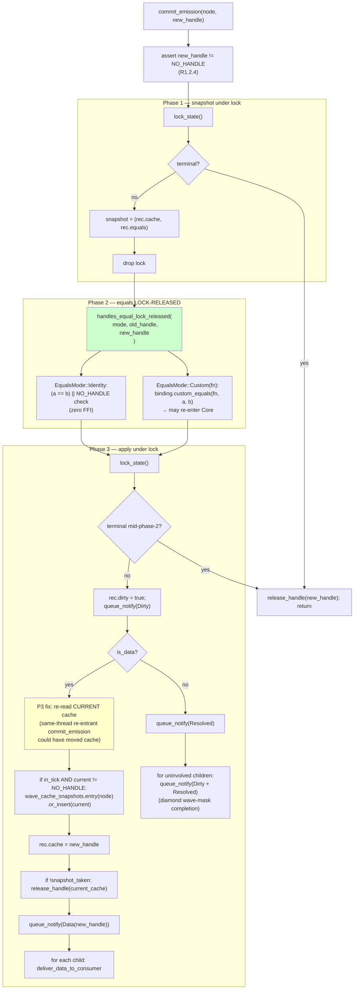

🟨 **D5 deferred:** `is_data` is computed in phase 2 against `(old_handle, new_handle)`; if a same-thread nested commit advances cache between phase 1 and phase 3, `is_data` may be stale. For Identity equals: benign duplicate Data. For Custom equals racing same-node: undefined.

---

### 2.4 `pick_next_fire` transitive walk (Slice C-1.5 diamond glitch fix)

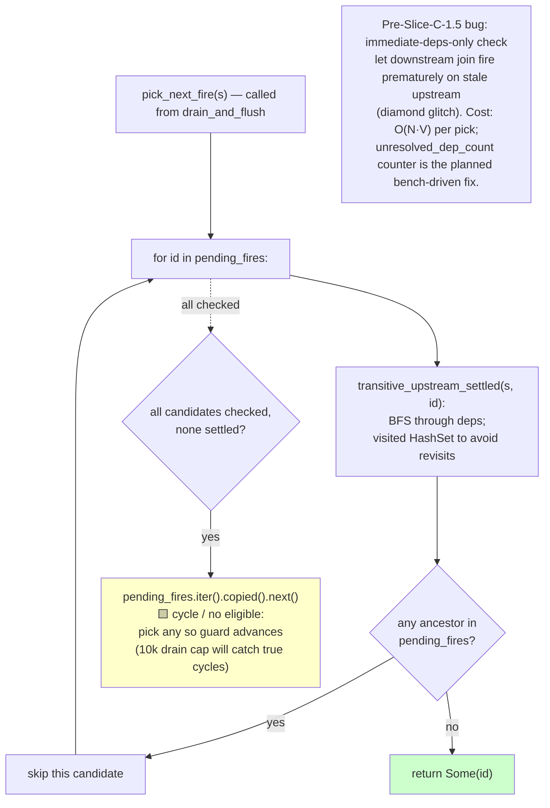

---

### 2.5 `flush_notifications` two-phase by tier (Slice C-1.5 R1.3.1.b)

🟦 Cross-node ordering preserves "phase 1 (DIRTY) propagates through entire graph before phase 2 (DATA/RESOLVED) begins" by tier-then-node iteration over a single `IndexMap`. No separate per-tier queues like TS's drainPhase.

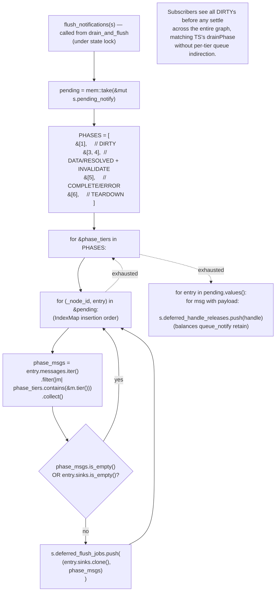

---

### 2.6 `queue_notify` pause routing + sink-snapshot-on-first-touch (Slice A close)

```mermaid
flowchart TB
    Entry["queue_notify(s, node, msg)"]
    BufferedTier{"msg.tier() in &#123;3, 4&#125;?"}
    NoSubs{"rec.subscribers.is_empty()?"}
    Return1["return (no subscribers)"]
    Paused{"rec.pause_state.is_paused()<br/>AND buffered_tier?"}
    PauseRetain["if msg.payload_handle():<br/>binding.retain_handle(h)"]
    PausePush["pause_state.push_buffered(msg, cap)<br/>→ overflow drops oldest;<br/>release dropped payloads"]
    NormalRetain["if msg.payload_handle():<br/>binding.retain_handle(h)"]
    NeedsSnapshot{"pending_notify<br/>contains_key(node)?"}
    BuildSnapshot["sinks_snapshot =<br/>rec.subscribers.values().cloned().collect()"]
    EmptySnapshot["sinks_snapshot = Vec::new()"]
    EntryMatch{"pending_notify.entry(node)?"}
    Vacant["insert PendingPerNode {<br/>  sinks: snapshot,<br/>  messages: vec![msg]<br/>}"]
    Occupied["push msg into existing<br/>entry.messages<br/>(reuse first-touch snapshot)"]

    Entry --> BufferedTier
    BufferedTier --> NoSubs
    NoSubs -- "yes" --> Return1
    NoSubs -- "no" --> Paused
    Paused -- "yes" --> PauseRetain
    PauseRetain --> PausePush
    PausePush --> Return2["return"]
    Paused -- "no" --> NormalRetain
    NormalRetain --> NeedsSnapshot
    NeedsSnapshot -- "yes" --> BuildSnapshot
    NeedsSnapshot -- "no" --> EmptySnapshot
    BuildSnapshot --> EntryMatch
    EmptySnapshot --> EntryMatch
    EntryMatch -- "Vacant" --> Vacant
    EntryMatch -- "Occupied" --> Occupied

    note["First-touch snapshot prevents duplicate-Data delivery<br/>when a late subscriber installed mid-wave between<br/>fn-fire iterations would otherwise see [Start, Data(post)]<br/>from handshake AND [Dirty, Data(post)] from wave flush."]
```

🟨 **D2 deferred:** the snapshot freezes at FIRST `queue_notify`. A subscriber installed BETWEEN two emits to the same node in one wave misses emit #2's flush. Niche scenario; Q1 punt; revisit alongside DS-14.

---

### 2.7 `BatchGuard` panic-discard + cache snapshot restore (Slice A-bigger /qa)

🟦 Atomicity guarantee covers BOTH sink-observability AND cache state. Without the cache-snapshot restore, a panicking `Core::batch` closure would leave state-node caches partially advanced.

```mermaid
sequenceDiagram
    participant U as User code
    participant BG as BatchGuard
    participant CS as CoreState
    participant Snap as wave_cache_snapshots
    participant B as binding release_handle

    U->>BG: begin_batch
    BG->>CS: lock; in_tick true; drop
    Note over BG: wave_guard holds wave_owner

    rect rgba(255, 200, 200, 0.2)
        Note over U,B: User closure panics partway through
        U->>U: emit s_a h1
        U->>CS: commit_emission writes cache s_a then h1<br/>wave_cache_snapshots insert s_a old_h_a
        U->>U: emit s_b h2
        U->>CS: commit_emission writes cache s_b then h2<br/>wave_cache_snapshots insert s_b old_h_b
        U-->>U: PANIC
    end

    BG->>BG: Drop sees thread is panicking
    BG->>CS: lock
    BG->>CS: pending = take pending_notify
    BG->>CS: deferred_releases = take deferred_handle_releases
    BG->>CS: take deferred_flush_jobs
    BG->>CS: clear pending_fires
    BG->>Snap: restore_wave_cache_snapshots<br/>for each node old_h pair<br/>current = replace rec cache with old_h<br/>if current is not NO_HANDLE<br/>queue current for release
    BG->>CS: clear_wave_state<br/>in_tick false; drop
    BG->>B: release retains lock-released<br/>pending payload handles<br/>deferred_releases<br/>restored_releases (displaced caches)

    Note over U,B: Subscribers observe NOTHING from the panicked wave.<br/>cache_of(s_a) returns old_h_a, not h1.
```

---

## Batch 3 — Lifecycle

### 3.1 Subscribe protocol with R1.3.5.a per-tier handshake split (Slice A close)

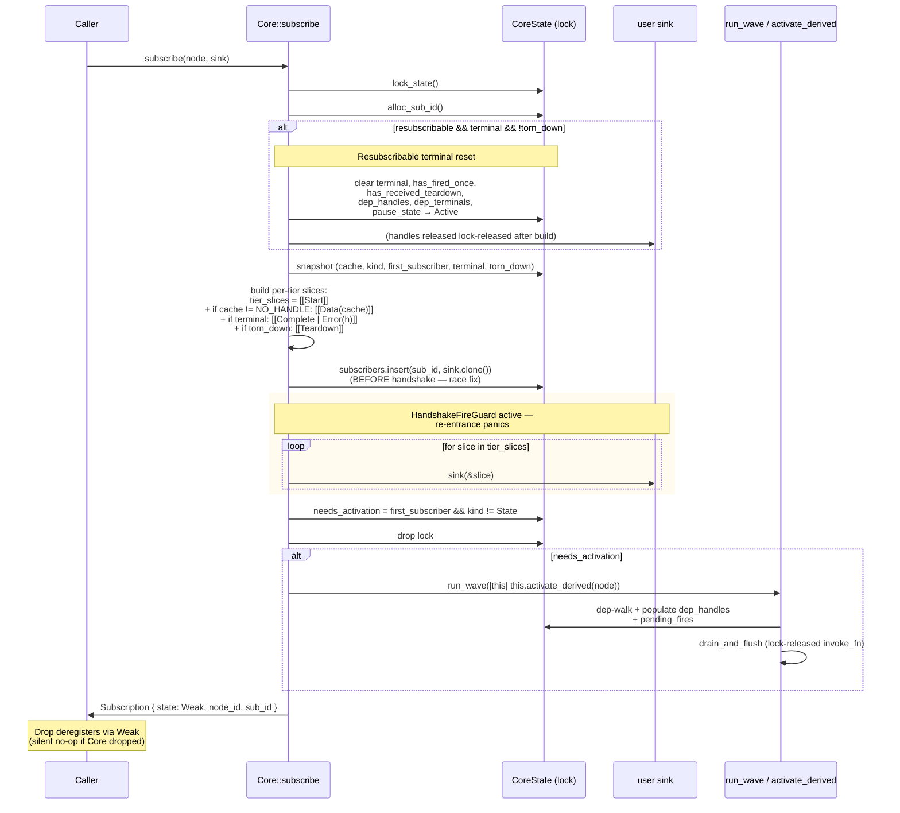

---

### 3.2 `activate_derived` two-phase DFS (Slice A close)

🟦 Replaces TS's recursive `_activate` with explicit two-phase: discover (post-order DFS via Vec stack) → deliver (forward iteration, per-dep `deliver_data_to_consumer`).

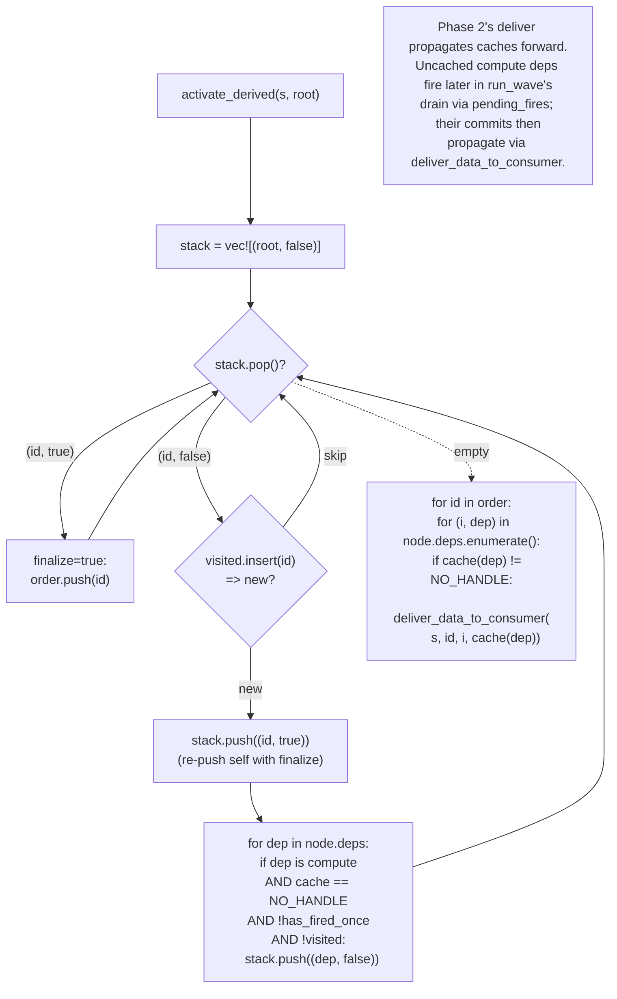

---

### 3.3 Terminal cascade — `terminate_node` iterative + Lock 2.B auto-cascade (Slice A-bigger)

🟦 Iterative work-queue replaces TS recursion. Linear chains of 5000 nodes cascade without stack overflow (verified `tests/cascade_depth.rs`).

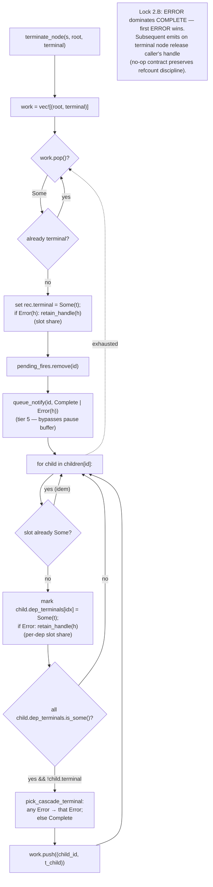

---

### 3.4 `teardown_inner` iterative with R1.3.9.d meta ordering (Slice A-bigger)

The R1.3.9.d "metas first, then self, then children" ordering is preserved by an explicit `Visit` / `EmitTeardown` action stack.

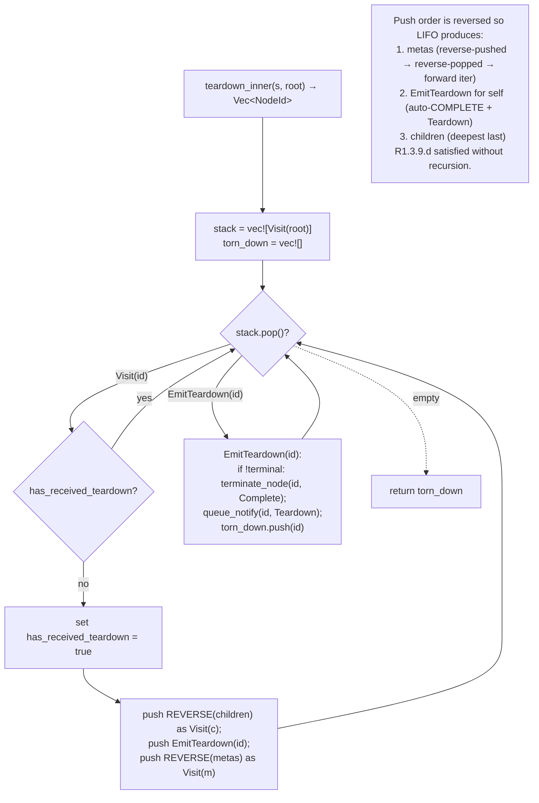

---

### 3.5 INVALIDATE cascade iterative (Slice A-bigger)

R1.4 idempotency-within-wave is naturally provided by the `cache == NO_HANDLE` already-invalidated guard.

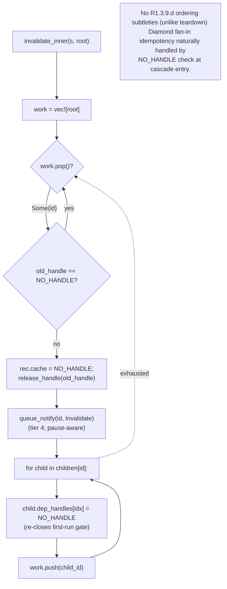

---

### 3.6 `set_deps` atomic dep mutation (TLA+ verified; Phase 13.8 Q1 + Slice A close /qa P2)

```mermaid
flowchart TB
    Entry["Core::set_deps(n, new_deps)"]

    subgraph Validate["Validation phase (under lock)"]
        ExistCheck{"n exists?"}
        ComputeCheck{"kind != State?"}
        TermCheck{"n.terminal.is_some()?"}
        SelfCheck{"new_deps.contains(n)?"}
        DepsExistCheck{"all new_deps registered?"}
        CycleCheck{"path_from_to(n, added_dep)<br/>via children edges<br/>=&gt; cycle?"}
        Q1Check{"added dep is terminal<br/>AND !resubscribable?"}
        Idem{"new_deps == current?"}
    end

    subgraph Mutate["Mutation phase (still under lock)"]
        BuildHandles["new_dep_handles preserves<br/>kept-dep handles by NodeId map"]
        BuildTerms["new_dep_terminals preserves<br/>kept-dep terminals"]
        F1Collect["F1: collect Error handles<br/>from REMOVED dep_terminal slots<br/>(must release; otherwise leaks)"]
        WriteDeps["rec.deps = new_deps;<br/>rec.dep_handles = ...;<br/>rec.dep_terminals = ...;<br/>if Derived: tracked = (0..n);<br/>if Dynamic: tracked.clear() +<br/>has_fired_once = false"]
        Children["children map update:<br/>remove inverted edges for removed,<br/>insert for added"]
        Snapshot["snapshot old_deps_vec,<br/>added_for_wave"]
        DropLock["drop lock"]
    end

    subgraph Wave["Push-on-add phase (lock-released entry)"]
        FireTopo["fire_topology_event(<br/>  DepsChanged { node, old, new }<br/>)"]
        RunWave{"added_for_wave.is_empty()?"}
        InsideClosure["run_wave(|this| {<br/>  re-acquire lock<br/>  defensive: n exists &amp; not terminal?<br/>  for added_dep:<br/>    re-read cache UNDER wave-owner lock<br/>    (P2 fix: prevents dangling HandleId)<br/>    if cache != NO_HANDLE:<br/>      deliver_data_to_consumer(n, idx, cache)<br/>})"]
        ReleaseRemoved["for h in removed_terminal_handles:<br/>release_handle(h)"]
    end

    Entry --> ExistCheck
    ExistCheck -- "no" --> ErrUnknown["Err(UnknownNode)"]
    ExistCheck -- "yes" --> ComputeCheck
    ComputeCheck -- "no" --> ErrCompute["Err(NotComputeNode)"]
    ComputeCheck -- "yes" --> TermCheck
    TermCheck -- "yes" --> ErrTerm["Err(TerminalNode)"]
    TermCheck -- "no" --> SelfCheck
    SelfCheck -- "yes" --> ErrSelf["Err(SelfDependency)"]
    SelfCheck -- "no" --> DepsExistCheck
    DepsExistCheck -- "no" --> ErrUnknown
    DepsExistCheck -- "yes" --> CycleCheck
    CycleCheck -- "yes" --> ErrCycle["Err(WouldCreateCycle)"]
    CycleCheck -- "no" --> Q1Check
    Q1Check -- "yes" --> ErrTermDep["Err(TerminalDep)"]
    Q1Check -- "no" --> Idem
    Idem -- "yes" --> Ok1["Ok(()) — fast path"]
    Idem -- "no" --> BuildHandles
    BuildHandles --> BuildTerms
    BuildTerms --> F1Collect
    F1Collect --> WriteDeps
    WriteDeps --> Children
    Children --> Snapshot
    Snapshot --> DropLock
    DropLock --> FireTopo
    FireTopo --> RunWave
    RunWave -- "no (added)" --> InsideClosure
    RunWave -- "yes" --> ReleaseRemoved
    InsideClosure --> ReleaseRemoved
    ReleaseRemoved --> Ok2["Ok(())"]

    style F1Collect fill:#cfc
    style InsideClosure fill:#ffc

    note["TLA+ verified: docs/research/wave_protocol_rewire.tla<br/>35,950 distinct states; all 7 invariants clean."]
```

🟨 **D1 deferred:** re-entrant `set_deps(n)` from inside `n`'s own firing fn corrupts Dynamic `tracked` indices. `Graph::set_deps` widens this surface (Slice E+); rustdoc `# Hazards` is the only mitigation today.

---

## Batch 4 — Drop / refcount discipline

### 4.1 `Drop for CoreState` — full handle-release walk (Slice A-bigger /qa)

🟦 Without this, every retained handle in `cache` / `terminal` Error / `dep_terminals` Error / pause-buffer-payload leaked in the binding registry until process exit.

```mermaid
flowchart TB
    Entry["impl Drop for CoreState::drop"]
    DrainPending["pending = take(pending_notify);<br/>release each msg.payload_handle()"]
    DrainDeferred["deferred_releases = take(deferred_handle_releases);<br/>release each"]
    DropFlush["take(deferred_flush_jobs)<br/>(Sink Arcs drop naturally)"]
    NodeWalk["for rec in nodes.values():"]
    Cache["if rec.cache != NO_HANDLE:<br/>release_handle(cache)"]
    Term["if let Some(Error(h)) = rec.terminal:<br/>release_handle(h)"]
    DepTerms["for slot in dep_terminals:<br/>if Some(Error(h)): release_handle(h)"]
    PauseBuf["if Paused { buffer, .. }:<br/>for msg in buffer:<br/>release each payload_handle()"]
    Snapshots["take(wave_cache_snapshots);<br/>release each snapshotted handle<br/>(defensive — should be empty<br/>in success path)"]

    Entry --> DrainPending
    DrainPending --> DrainDeferred
    DrainDeferred --> DropFlush
    DropFlush --> NodeWalk
    NodeWalk --> Cache
    Cache --> Term
    Term --> DepTerms
    DepTerms --> PauseBuf
    PauseBuf -. next node .-> NodeWalk
    NodeWalk -. exhausted .-> Snapshots

    note["Safe to call during panic unwinding —<br/>release_handle is the only call,<br/>and a panicking binding during cleanup<br/>was already broken."]
```

---

### 4.2 Refcount discipline across slot types

Where each handle's refcount share lives, who retains it, who releases it.

| Slot | Retained by | Released by |
|------|-------------|-------------|
| `cache: HandleId` | `commit_emission` phase 3 (transfers caller's intern share) | `commit_emission` when displaced; `invalidate_inner`; `Drop for CoreState` |
| `terminal: Some(Error(h))` | `terminate_node` `retain_handle(h)` | `reset_for_fresh_lifecycle` (resubscribable); `Drop for CoreState` |
| `dep_terminals[i]: Some(Error(h))` | `terminate_node` per child slot | `set_deps` F1 fix (removed dep slot); `reset_for_fresh_lifecycle`; `Drop for CoreState` |
| `pause_state.buffer` payload | `queue_notify` `retain_handle(h)` | `resume` after sink fire; overflow drop; `reset_for_fresh_lifecycle`; `Drop for CoreState` |
| `pending_notify[node].messages` payload | `queue_notify` `retain_handle(h)` | `flush_notifications` → `deferred_handle_releases` → `fire_deferred`; `BatchGuard` panic-discard; `Drop for CoreState` |
| `wave_cache_snapshots[node]` | `commit_emission` phase 3 (first commit per node per wave) | `commit_wave_cache_snapshots` (success); `restore_wave_cache_snapshots` (panic — transferred to cache slot); `Drop for CoreState` |
| `caller's intern share` (entry-point arg) | binding's `intern(value)` | `Core::emit` short-circuit on terminal; `Core::error` always; `commit_emission` short-circuit on terminal |

---

## Batch 5 — Topology + Graph container (M2)

### 5.1 `subscribe_topology` + `TopologyEvent` (Slice F)

```mermaid
classDiagram
    class TopologyEvent {
        <<enum>>
        NodeRegistered
        NodeTornDown
        DepsChanged
    }
    class TopologySink {
        <<typeAlias>>
    }
    class TopologySubscription {
        -id
        -state
        +Drop
    }
    class Core {
        +subscribe_topology(sink) TopologySubscription
        +fire_topology_event(event)
    }
    Core --> TopologySink : sinks
    Core ..> TopologyEvent : fires
    TopologySubscription ..> Core : Weak ref
```

**Variant payloads:**
- `TopologyEvent::NodeRegistered(NodeId)`
- `TopologyEvent::NodeTornDown(NodeId)`
- `TopologyEvent::DepsChanged { node, old_deps, new_deps }`

**Type aliases / fields:**
- `TopologySink = Arc<dyn Fn(&TopologyEvent) + Send + Sync>`
- `TopologySubscription { id: u64, state: Weak<Mutex<CoreState>> }`
- `Drop` impl: silent no-op if Core gone; else `topology_sinks.remove(id)`.
- `Core::fire_topology_event` is `pub(crate)`.

```mermaid
flowchart LR
    Reg["Core::register_state /<br/>register_computed"] -. "after lock drop" .-> RegEvent["NodeRegistered(id)"]
    TD["Core::teardown"] -. "for root + each cascaded id<br/>(meta + downstream)" .-> TDEvent["NodeTornDown(id)"]
    SD["Core::set_deps"] -. "after lock drop, only if<br/>actually rewired (not idempotent)" .-> DCEvent["DepsChanged { ... }"]
    RegEvent --> Sinks["all topology_sinks fire<br/>OUTSIDE state lock"]
    TDEvent --> Sinks
    DCEvent --> Sinks

    note["NodeRegistered fires BEFORE Graph::add inserts the name —<br/>sinks calling graph.name_of(id) see None.<br/>Graph-layer namespace_change hook covers that gap."]
```

---

### 5.2 Graph + GraphInner shape (Slice D + E+)

```mermaid
classDiagram
    class Graph {
        +core
        +inner
        +new(name, binding) Graph
        +clone() Graph
        +core() readonly
    }
    class GraphInner {
        <<lockProtected>>
        +name
        +names
        +names_inverse
        +children
        +parent
        +destroyed
        +namespace_sinks
        +next_ns_sink_id
    }
    Graph --> GraphInner : Arc Mutex
    Graph ..> Graph : children mounted

    note for Graph "Lock acquisition rule: Graph then Core only, never Core then Graph. Two-graph operations like mount: parent then child."
```

**Field types:**

| Class | Field | Type |
|-------|-------|------|
| `Graph` | `core` | `Core` (Arc-cloned) |
| `Graph` | `inner` | `Arc<Mutex<GraphInner>>` |
| `GraphInner` | `name` | `String` |
| `GraphInner` | `names` | `IndexMap<String, NodeId>` |
| `GraphInner` | `names_inverse` | `IndexMap<NodeId, String>` |
| `GraphInner` | `children` | `IndexMap<String, Graph>` |
| `GraphInner` | `parent` | `Option<Weak<Mutex<GraphInner>>>` (cycle break) |
| `GraphInner` | `destroyed` | `bool` |
| `GraphInner` | `namespace_sinks` | `IndexMap<u64, NamespaceChangeSink>` |
| `GraphInner` | `next_ns_sink_id` | `u64` |

🟦 `Weak<Mutex<GraphInner>>` for `parent` is Rust-specific compile-time cycle prevention (TS uses a strong ref + manual cycle break).

---

### 5.3 Mount lock ordering + TOCTOU fix (Slice E+ /qa B1)

```mermaid
sequenceDiagram
    participant U as User
    participant P as parent.inner
    participant Ch as child.inner
    participant Core
    participant NSink as namespace_sinks

    U->>P: mount(name, child)
    Note over P: validate `::` separator
    P->>Core: parent.core.same_dispatcher(&child.core)?
    Core-->>P: Arc::ptr_eq result
    alt different Core
        P-->>U: Err(MountError::CoreMismatch)
    end

    rect rgba(255, 240, 200, 0.3)
        Note over P,Ch: B1 fix — hold parent lock across<br/>validation + child-lock acquisition + insert
        P->>P: parent_inner.lock()
        P->>P: destroyed? children.contains? names.contains?
        P->>Ch: child_inner.lock()
        P->>Ch: child.parent.is_some()?
        alt already mounted
            P-->>U: Err(MountError::AlreadyMounted)
        end
        P->>Ch: child.parent = Some(weak(parent.inner))
        P->>P: parent_inner.children.insert(name, child)
        P->>Ch: drop child lock
        P->>P: drop parent lock
    end

    P->>NSink: parent.fire_namespace_change()<br/>(P3 fix from /qa Slice F:<br/>reactive describe / observe_all<br/>see mount as namespace change)
    P-->>U: Ok(child)

    Note over U,NSink: Lock order: parent → child. No Graph code<br/>acquires parent from inside child.
```

---

### 5.4 `destroy()` reorder (Slice E+ /qa B3)

R3.7.3 ordering: namespace MUST stay intact during the TEARDOWN cascade so sinks observing `[Teardown]` can resolve names via `name_of` / `try_resolve`.

```mermaid
flowchart TB
    Entry["Graph::destroy()"]
    Lock["lock inner"]
    Idem{"already destroyed?"}
    SetDestroyed["destroyed = true"]
    SnapshotIds["snapshot:<br/>own_ids = names.values()<br/>kids = children.values().cloned()"]
    DropLock["drop lock"]
    RecurseKids["for kid in kids:<br/>kid.destroy() (recursive)"]
    TeardownOwn["for id in own_ids:<br/>core.teardown(id)<br/>(sinks resolve names mid-cascade)"]
    LockClear["re-lock inner"]
    ClearReg["names.clear();<br/>names_inverse.clear();<br/>children.clear()"]
    DropLock2["drop lock"]
    FireNS["fire_namespace_change()<br/>(reactive describe sees clear)"]

    Entry --> Lock
    Lock --> Idem
    Idem -- "yes" --> Ret["return"]
    Idem -- "no" --> SetDestroyed
    SetDestroyed --> SnapshotIds
    SnapshotIds --> DropLock
    DropLock --> RecurseKids
    RecurseKids --> TeardownOwn
    TeardownOwn --> LockClear
    LockClear --> ClearReg
    ClearReg --> DropLock2
    DropLock2 --> FireNS

    style TeardownOwn fill:#cfc
    style ClearReg fill:#ffc

    note["Pre-B3 order cleared registries first, so sinks<br/>observing TEARDOWN saw an empty namespace.<br/>Regression test: destroy_preserves_namespace_during_teardown_cascade."]
```

---

## Batch 6 — Read-side surface (Slice E+)

### 6.1 Namespace path resolution (`try_resolve`)

```mermaid
flowchart TB
    Entry["graph.try_resolve(path)"]
    Split["segments = path.split(::)"]
    First["first = segments.next()?"]
    Lock["lock inner"]
    HasRest{"path has<br/>::-suffix?"}
    LookupChild["children.get(first)?<br/>→ subgraph"]
    DropLock["drop lock"]
    Recurse["child.try_resolve(rest)"]
    LocalLookup["names.get(first).copied()"]

    Entry --> Split
    Split --> First
    First --> Lock
    Lock --> HasRest
    HasRest -- "yes (e.g. 'mount::node')" --> LookupChild
    LookupChild --> DropLock
    DropLock --> Recurse
    HasRest -- "no" --> LocalLookup
    Recurse --> Ret1["Option&lt;NodeId&gt;"]
    LocalLookup --> Ret2["Option&lt;NodeId&gt;"]

    note["🟨 Deferred: '..::sibling::node' (cross-subgraph<br/>relative paths per R3.5.2). v1 only supports<br/>root-relative descent.<br/>🟨 Deferred: malformed paths ('::foo', 'foo::',<br/>'a::::b') silently return None — no PathError."]
```

---

### 6.2 `describe()` JSON build (Slice E+ + /qa B4)

```mermaid
flowchart TB
    Entry["graph.describe()"]
    Lock["lock inner"]
    SnapshotNS["local_names: IndexMap&lt;NodeId, String&gt;<br/>names_iter: Vec&lt;(name, id)&gt;<br/>subgraphs: Vec&lt;String&gt;"]
    DropLock["drop lock<br/>(no Graph lock during Core probes)"]
    Iterate["for (name, id) in names_iter:"]
    Probes["core.kind_of(id)<br/>core.cache_of(id)<br/>core.is_terminal(id)<br/>core.is_dirty(id)<br/>core.has_fired_once(id)<br/>core.deps_of(id)<br/>(each = single Core lock)"]
    DepNames["dep_names: lookup local_names<br/>or fallback to '_anon_&lt;id&gt;'"]
    EdgeBuild["edges.push(EdgeDescribe { from, to })"]
    StatusOf["status_of(kind, cache, terminal,<br/>dirty, fired):<br/>errored &gt; completed &gt; dirty &gt;<br/>settled &gt; pending &gt; sentinel"]
    BuildNode["NodeDescribe {<br/>  type, status,<br/>  value: Option&lt;HandleId&gt; (skip None),<br/>  deps: dep_names,<br/>  meta: None (B4 reserved field)<br/>}"]
    Insert["nodes.insert(name, NodeDescribe)"]
    BuildOut["GraphDescribeOutput {<br/>  name, nodes (insertion order),<br/>  edges, subgraphs<br/>}"]

    Entry --> Lock
    Lock --> SnapshotNS
    SnapshotNS --> DropLock
    DropLock --> Iterate
    Iterate --> Probes
    Probes --> DepNames
    DepNames --> EdgeBuild
    EdgeBuild --> StatusOf
    StatusOf --> BuildNode
    BuildNode --> Insert
    Insert --> Iterate
    Iterate -. exhausted .-> BuildOut

    note["🟨 value: Option&lt;HandleId&gt; surfaces raw u64,<br/>not user-rendered T (cleaving plane divergence).<br/>Bindings provide describe_with_values wrapper.<br/>Mounted children's nodes NOT inlined —<br/>recurse via graph.node(child).describe() per Q4."]
```

---

### 6.3 `observe()` / `observe_all()` shape (Slice E+ default + Slice F reactive)

```mermaid
classDiagram
    class GraphObserveOne {
        -graph
        -node_id
        +subscribe(sink) Subscription
        +pause(lock)
        +resume(lock)
        +invalidate()
    }
    class GraphObserveAll {
        -graph
        -subs
        +subscribe(sink) usize
    }
    class GraphObserveAllReactive {
        -graph
        -ns_sink_id
        -inner
        +subscribe(sink)
    }
    class ObserveAllReactiveInner {
        +subscribed
        +subs
    }

    GraphObserveAllReactive --> ObserveAllReactiveInner : Arc Mutex

    note for GraphObserveOne "R3.6.2 divergence (F12): Canonical up(messages); Rust decomposes to pause(lock) / resume(lock) / invalidate() to avoid Vec allocation per upstream call."
    note for GraphObserveAll "Snapshot-at-subscribe-time: nodes added AFTER subscribe not auto-subscribed. Use observe_all_reactive for dynamic membership."
```

**Field types and Drop semantics:**

| Class | Field / signature | Type / behavior |
|-------|-------------------|-----------------|
| `GraphObserveOne` | `graph` | `Graph` |
| `GraphObserveOne` | `node_id` | `NodeId` |
| `GraphObserveOne` | `pause(lock)` | `Result<(), PauseError>` |
| `GraphObserveOne` | `resume(lock)` | `Result<Option<ResumeReport>, PauseError>` |
| `GraphObserveAll` | `subs` | `Vec<Subscription>` |
| `GraphObserveAll` | `subscribe<F>(sink)` | generic over closure type |
| `GraphObserveAll` | `Drop` | drops all `Subscription`s in vec |
| `GraphObserveAllReactive` | `ns_sink_id` | `Option<u64>` |
| `GraphObserveAllReactive` | `inner` | `Arc<Mutex<ObserveAllReactiveInner>>` |
| `GraphObserveAllReactive` | `Drop` | unsubscribe namespace sink BEFORE `inner` drops (deadlock prevention) |
| `ObserveAllReactiveInner` | `subscribed` | `HashSet<NodeId>` |
| `ObserveAllReactiveInner` | `subs` | `Vec<Subscription>` |

---

## Cross-references

### Slice → diagram map

| Slice | Diagrams |
|-------|----------|
| Slice A+B (M1 base) | 1.1, 1.2, 3.3, 3.4, 3.5, 3.6, 4.1, 4.2 |
| Slice A-bigger | 1.3 (drop-then-fire), 3.3, 3.4, 3.5, 4.2 |
| Slice A close | 1.3 (lock-released), 1.4, 2.1, 2.2, 2.3, 2.6, 3.1, 3.2 |
| Slice C-1 | 2.1 (batch.rs split — no semantic change) |
| Slice C-1.5 | 2.1, 2.4, 2.5, 2.7 |
| Slice C-2 | (proptest invariants — see `tests/proptest_invariants.rs`) |
| Slice D | 5.2 (Slice D shape; superseded sugar) |
| Slice E+ | 5.2 (final shape), 5.3, 5.4, 6.1, 6.2, 6.3 |
| Slice F | 5.1, 6.3 (reactive variants) |

### Spec rule → diagram map (subset)

| Rule | Diagram |
|------|---------|
| R1.2.6 (PAUSE/RESUME lockId) | 1.2 |
| R1.3.1.b (two-phase push) | 2.5 |
| R1.3.5.a (per-tier handshake) | 3.1 |
| R1.3.6.a/b (batch coalescing) | 2.1, 2.7 |
| R1.3.8.a–f (PAUSE state machine) | 1.2, 2.6 |
| R1.3.9.d (meta TEARDOWN ordering) | 3.4 |
| R1.4 (INVALIDATE bidirectionality) | 3.5 |
| R2.2.3 / R1.2.3 (subscribe handshake) | 3.1 |
| R2.6.4 / Lock 6.F (auto-COMPLETE) | 3.3, 3.4 |
| R3.3.1.1 (set_deps) | 3.6 |
| R3.4 (mount) | 5.3 |
| R3.5 (namespace) | 6.1 |
| R3.6.1 (describe) | 6.2 |
| R3.6.2 (observe) | 6.3 |
| R3.7.3 (destroy ordering) | 5.4 |

### Deferred items by diagram

| Diagram | Item | Deferred entry |
|---------|------|----------------|
| 1.4 | Subscribe handshake fires lock-held | "Subscribe-time handshake fires lock-held" |
| 2.3 | `is_data` cache-race for Custom equals | D5 |
| 2.4 | `pick_next_fire` O(N·V) per pick | "pick_next_fire transitive upstream walk" |
| 2.4 | Cycle fallback busy-loop | "Wave-drain pick_next_fire cycle fallback" |
| 2.6 | Late subscriber + multi-emit-per-wave | D2 |
| 3.6 | Re-entrant set_deps from firing fn | D1 |
| 6.1 | Sibling cross-subgraph paths | "try_resolve no `..::sibling::node`" |
| 6.1 | Malformed path silent None | "try_resolve silent None on malformed" |
| 6.2 | `value: HandleId` not `T` | "describe value field surfaces raw HandleId" |
| 6.3 | `up()` decomposed | F12 |
| 6.3 | Snapshot-at-subscribe-time | (resolved in Slice F via reactive variant) |

---

## Maintenance

When a new slice lands:

1. Update the timeline diagram (0.3) with the new slice node.
2. Add diagrams for any new Core/Graph methods or new state machines. Cite the canonical spec rule (`R<x.y.z>`) the diagram visualizes — don't restate the spec, link to it.
3. Mark v1 limitations with 🟨 callouts pointing at `porting-deferred.md` entries.
4. Update the "Slice → diagram map" and "Spec rule → diagram map" tables in this section.
5. If a previously-deferred item lands, update the corresponding diagram's callout (remove 🟨, add a "resolved in Slice X" note) and remove the row from "Deferred items by diagram."

When closing a milestone:

1. Verify every public API surfaced in the closing migration-status entry has at least one diagram covering it.
2. Run `/rust-review` against the closing slice; the review's behavioral traces should be representable as sequence diagrams here. If a trace surfaces a state machine not yet diagrammed, add it.
