# GraphReFly Rust Port Flowcharts

> **Historical port-era diagrams.** These diagrams document the retired
> multi-crate Rust port model and are retained as an audit trail. They are not
> current architecture guidance. Current Rust package docs are governed by
> [`docs.jsonl`](docs.jsonl); language-neutral authority lives in
> `~/src/graphrefly`.

*Mermaid diagrams covering the Rust port's distinctive shape: workspace layout, the handle-protocol cleaving plane, lock discipline, RAII patterns, wave-engine state machine, and Graph container — all for the surface that's actually landed.*

**Companion docs:**
- `~/src/graphrefly-ts/docs/implementation-plan-13.6-canonical-spec.md` — canonical spec rules `R<x.y.z>`.
- `~/src/graphrefly-ts/docs/implementation-plan-13.6-flowcharts.md` — TS-side spec flowcharts. Read those for *protocol semantics*; read this for *Rust shape*.
- `migration-status.md` — slice-by-slice landed/deferred record.
- `porting-deferred.md` — known v1 limitations.

**Slice coverage:** A → A-bigger → A close → B → C → C-1 → C-1.5 → C-2 → D → E+ → F (M2 close) → M3 Slice A → M3 Slice B → M3 Slice C-1/C-2/C-3 (operators) → M3 Slice D-substrate → M3 Slice D-ops → M3 Slice E (higher-order) → M3 Slice F (canonical correctness) → M3 Slice G (per-wave equals) → M3 Slice E1 (replay) → M3 Slice H (typed errors).

**Conventions:**
- Solid arrow → control flow. Dashed arrow → data/message flow. Dotted arrow → optional/conditional path.
- Decision diamonds use the `{}` shape with a question.
- 🟨 **YELLOW** flags v1 limitations / documented divergences from canonical spec (lifts in a later slice).
- 🟦 **BLUE** flags Rust-specific simplifications versus TS (no protocol meaning; just port shape).
- Method names match the source. `pub` methods omit prefix; `pub(crate)` / private methods are noted in their callouts.

---

## Batch 0 — Workspace overview

### 0.1 Crate map

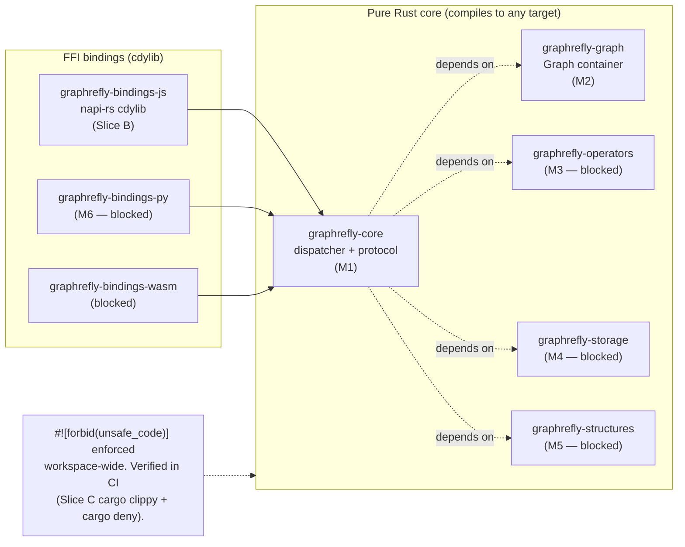

---

### 0.2 Handle-protocol cleaving plane (R6 / Implementation Delta)

The **Core never sees user values `T`**. All payload-bearing messages carry `HandleId(u64)`. The binding side owns the handle→value registry; identity-equals is a pure `u64` compare with zero FFI.

```mermaid
flowchart TB
    subgraph Binding["Binding side (graphrefly-bindings-js / -py / -wasm)"]
        Registry["HandleId → T registry<br/>(Map&lt;HandleId, &#123; value, refcount &#125;&gt;)"]
        Intern["intern(value) → HandleId"]
        Resolve["resolve(handle) → T"]
        UserFn["user fn body (T-typed)"]
    end

    subgraph Boundary["BindingBoundary trait (Send + Sync)"]
        invoke["invoke_fn(node_id, fn_id, &amp;[HandleId]) → FnResult"]
        equals["custom_equals(equals_id, a, b) → bool"]
        retain["retain_handle(h)"]
        release["release_handle(h)"]
    end

    subgraph Core["Core (graphrefly-core)"]
        cache["cache: HandleId<br/>(NO_HANDLE = sentinel)"]
        dispatcher["dispatcher logic<br/>(zero T awareness)"]
        identityEq["EqualsMode::Identity<br/>= u64 compare<br/>(zero FFI)"]
    end

    UserFn -. emit DATA(value) .-> Intern
    Intern --> Registry
    Intern -. handle .-> Core
    dispatcher -.-> invoke
    invoke -.-> Registry
    Registry -.-> UserFn
    UserFn -.-> invoke
    dispatcher -.-> retain
    dispatcher -.-> release
    retain -.-> Registry
    release -.-> Registry
    dispatcher --> identityEq
    dispatcher -. only when EqualsMode::Custom .-> equals

    note["Performance contract: ONE FFI call per fn fire,<br/>regardless of dep count.<br/>Identity equals never crosses the boundary."]
    note -.-> Core
```

---

### 0.3 Slice progression timeline (M1 → M2 close)

```mermaid
flowchart LR
    A["Slice A+B<br/>2026-05-05<br/>PAUSE/RESUME, INVALIDATE,<br/>COMPLETE/ERROR cascade,<br/>TEARDOWN auto-COMPLETE,<br/>meta TEARDOWN ordering,<br/>RAII Subscription,<br/>set_deps TLA+-verified"]
    Ab["Slice A-bigger<br/>2026-05-05<br/>drop-then-fire flush,<br/>iterative cascades<br/>(5000-node chains),<br/>subscribe-vs-emit race fix,<br/>IN_HANDSHAKE_FIRE diagnostic"]
    Ac["Slice A close<br/>2026-05-05<br/>lock-released invoke_fn,<br/>lock-released custom_equals,<br/>R1.3.5.a per-tier handshake,<br/>sink-snapshot-on-first-touch,<br/>wave_owner ReentrantMutex"]
    B["Slice B<br/>2026-05-05<br/>napi-rs binding parity"]
    C["Slice C<br/>2026-05-05<br/>CI scaffold + TLC<br/>(cargo fmt/check/clippy/test/<br/>doc/deny + TLA+ MC)"]
    C1["Slice C-1<br/>2026-05-05<br/>batch.rs sibling-module<br/>extraction (no semantic change)"]
    C15["Slice C-1.5<br/>2026-05-05<br/>user-facing batch + RAII guard,<br/>R1.3.1.b two-phase delivery,<br/>transitive pick_next_fire<br/>(diamond glitch fix)"]
    C2["Slice C-2<br/>2026-05-05<br/>proptest framework<br/>(7 protocol invariants)"]
    D["Slice D (M2 starter)<br/>2026-05-05<br/>Graph container,<br/>nameless sugar,<br/>lifecycle pass-throughs"]
    E["Slice E+<br/>2026-05-05<br/>Core inspection helpers,<br/>Graph namespace + sugar,<br/>mount/unmount,<br/>describe() JSON,<br/>observe() sink-style"]
    F["Slice F<br/>2026-05-06<br/>named-sugar wrappers,<br/>remove(name), edges(opts),<br/>signal(kind),<br/>topology event primitive,<br/>reactive describe / observe_all"]

    M3A["M3 Slice A<br/>2026-05-06<br/>DepRecord per-dep<br/>+ DepBatch FFI<br/>+ R1.3.6.b wave-end rotation"]
    M3B["M3 Slice B<br/>2026-05-06<br/>FnResult::Batch<br/>+ commit_emission_verbatim<br/>+ pending_auto_resolve"]
    M3C1["M3 Slice C-1<br/>2026-05-06<br/>NodeKind::Operator<br/>+ 6 transform ops<br/>+ Reduce Lock 2.B opt-out"]
    M3C2["M3 Slice C-2<br/>2026-05-06<br/>combine / withLatestFrom / merge<br/>+ pack_tuple FFI"]
    M3C3["M3 Slice C-3<br/>2026-05-06<br/>flow ops (take/skip/takeWhile/last)<br/>+ generic op_scratch trait"]
    M3Dsub["M3 Slice D-substrate<br/>2026-05-06<br/>Unified Core::register<br/>+ NodeKind drop refactor<br/>+ producer_deactivate hook"]
    M3Dops["M3 Slice D-ops<br/>2026-05-06<br/>ProducerCtx + zip/concat/race/takeUntil<br/>+ Recorder Weak-cycle break"]
    M3E["M3 Slice E<br/>2026-05-07<br/>switchMap / exhaustMap / concatMap / mergeMap<br/>+ HigherOrderBinding<br/>+ D045 lock-released handshake"]
    M3F["M3 Slice F<br/>2026-05-07<br/>Canonical correctness pass<br/>(pause-overflow ERROR, alloc_lock_id reservation,<br/>D1 reentrancy guard, status_of post-INVALIDATE,<br/>PausableMode {Default,ResumeAll,Off})"]
    M3FQA["M3 Slice F audit follow-on<br/>2026-05-07<br/>Tier-based dispatch refactor (~26 sites)<br/>+ Core::up + UpError"]
    M3G["M3 Slice G<br/>2026-05-07<br/>R1.3.2.d per-wave equals coalescing<br/>+ retroactive Resolved → Data rewrite"]
    M3E1["M3 Slice E1<br/>2026-05-07<br/>Replay buffer (R2.6.5 / Lock 6.G)"]
    M3H["M3 Slice H<br/>2026-05-07<br/>register* + set_pausable_mode<br/>typed-error promotion<br/>+ ScratchReleaseGuard RAII<br/>+ OperatorFactoryError"]

    A --> Ab --> Ac --> B
    Ac --> C
    Ac --> C1 --> C15 --> C2
    C2 --> D --> E --> F
    F --> M3A --> M3B --> M3C1 --> M3C2 --> M3C3
    M3C3 --> M3Dsub --> M3Dops --> M3E --> M3F --> M3FQA --> M3G --> M3E1 --> M3H

    style A fill:#bfd
    style Ab fill:#bfd
    style Ac fill:#bfd
    style B fill:#bfd
    style C fill:#bfd
    style C1 fill:#bfd
    style C15 fill:#bfd
    style C2 fill:#bfd
    style D fill:#cfe
    style E fill:#cfe
    style F fill:#cfe
    style M3A fill:#fec
    style M3B fill:#fec
    style M3C1 fill:#fec
    style M3C2 fill:#fec
    style M3C3 fill:#fec
    style M3Dsub fill:#fec
    style M3Dops fill:#fec
    style M3E fill:#fec
    style M3F fill:#fdb
    style M3FQA fill:#fdb
    style M3G fill:#fdb
    style M3E1 fill:#fdb
    style M3H fill:#fdb
```

---

## Batch 1 — Core shape & lock discipline

### 1.1 Core / CoreState struct

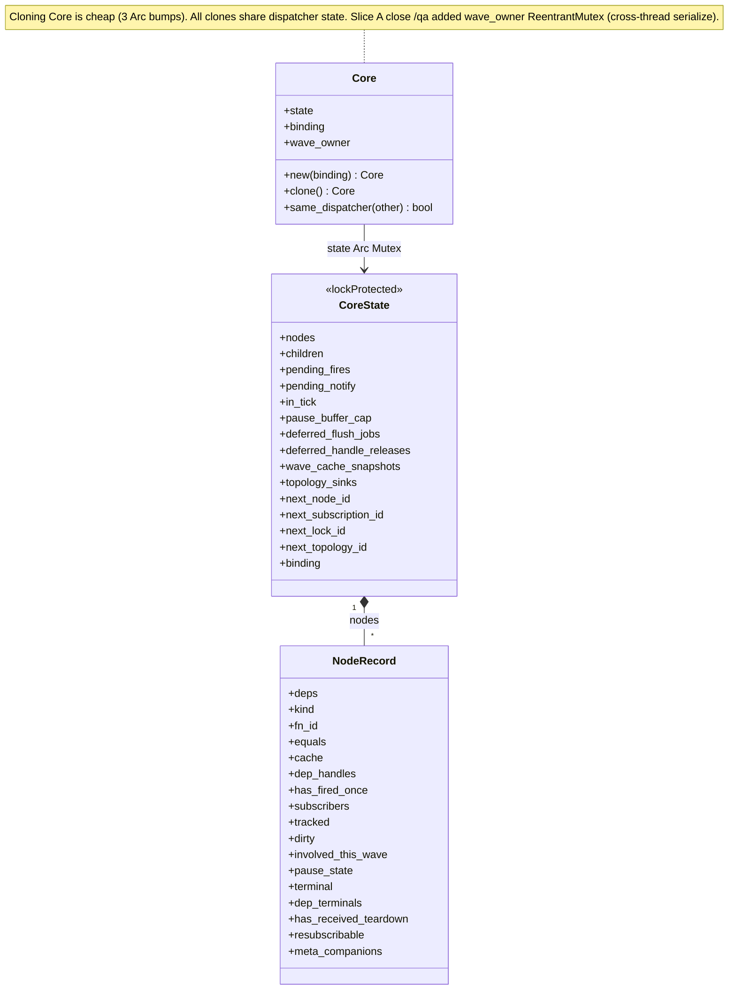

**Field types** (omitted from diagram to avoid Mermaid generic-syntax limitations):

| Class | Field | Type |
|-------|-------|------|
| `Core` | `state` | `Arc<Mutex<CoreState>>` |
| `Core` | `binding` | `Arc<dyn BindingBoundary>` |
| `Core` | `wave_owner` | `Arc<ReentrantMutex<()>>` |
| `CoreState` | `nodes` | `HashMap<NodeId, NodeRecord>` |
| `CoreState` | `children` | `HashMap<NodeId, HashSet<NodeId>>` |
| `CoreState` | `pending_fires` | `HashSet<NodeId>` |
| `CoreState` | `pending_notify` | `IndexMap<NodeId, PendingPerNode>` |
| `CoreState` | `pause_buffer_cap` | `Option<usize>` |
| `CoreState` | `deferred_flush_jobs` | `Vec<(Vec<Sink>, Vec<Message>)>` |
| `CoreState` | `deferred_handle_releases` | `Vec<HandleId>` |
| `CoreState` | `wave_cache_snapshots` | `HashMap<NodeId, HandleId>` |
| `CoreState` | `topology_sinks` | `HashMap<u64, TopologySink>` |
| `NodeRecord` | `deps` | `Vec<NodeId>` |
| `NodeRecord` | `kind` | `NodeKind` (`State` / `Derived` / `Dynamic`) |
| `NodeRecord` | `fn_id` | `Option<FnId>` |
| `NodeRecord` | `equals` | `EqualsMode` |
| `NodeRecord` | `cache` | `HandleId` |
| `NodeRecord` | `dep_handles` | `Vec<HandleId>` |
| `NodeRecord` | `subscribers` | `HashMap<SubscriptionId, Sink>` |
| `NodeRecord` | `tracked` | `HashSet<usize>` |
| `NodeRecord` | `pause_state` | `PauseState` |
| `NodeRecord` | `terminal` | `Option<TerminalKind>` |
| `NodeRecord` | `dep_terminals` | `Vec<Option<TerminalKind>>` |
| `NodeRecord` | `meta_companions` | `Vec<NodeId>` |

🟦 The **wave_owner re-entrant mutex** is Rust-specific. TS is single-threaded; PY is GIL-serialized; Rust is the first impl with parallel access. Acquired in `begin_batch` BEFORE the state lock — same-thread re-entry passes through, cross-thread emits block.

---

### 1.2 PauseState enum (Slice A+B simplification)

🟦 Replaces the four TS fields (`_pauseLocks`, `_pauseBuffer`, `_pauseDroppedCount`, `_pauseStartNs`) with a single enum where buffered fields are unreachable in `Active`. Compiler-enforced "Active ⟹ no buffer."

```mermaid
stateDiagram-v2
    [*] --> Active: node constructed
    Active --> Paused: add_lock(L1)<br/>(first lock; record started_at_ns)
    Paused --> Paused: add_lock(L2)<br/>(idempotent on duplicate)
    Paused --> Paused: remove_lock(unknown)<br/>no-op (R1.3.8.f)
    Paused --> Paused: remove_lock(Lk)<br/>locks.len() &gt; 1
    Paused --> Active: remove_lock(last)<br/>return (buffer, dropped)
    Paused --> Paused: push_buffered(msg, cap)<br/>tier 3+4 only
    Active --> [*]: Drop
    Paused --> [*]: Drop<br/>(Drop for CoreState releases<br/>buffer payload retains)

    note right of Paused
        struct fields:
        - locks: SmallVec&lt;[LockId; 2]&gt;
        - buffer: VecDeque&lt;Message&gt;
        - dropped: u32
        - started_at_ns: u64
        Cap overflow drops oldest.
    end note
```

---

### 1.3 Lock discipline progression (Slice A → A close)

The single largest port-shape evolution. Rust started with TS's "lock-held everywhere" shape; each slice lifted one binding-callback site to lock-released.

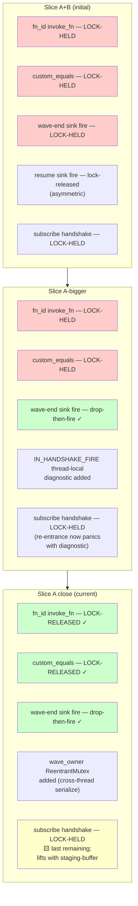

---

### 1.4 IN_HANDSHAKE_FIRE thread-local diagnostic

Subscribe-time handshake fires under the state lock (race-fix discipline). A handshake-time sink callback that re-enters Core would deadlock. The diagnostic turns deadlock into a clear panic.

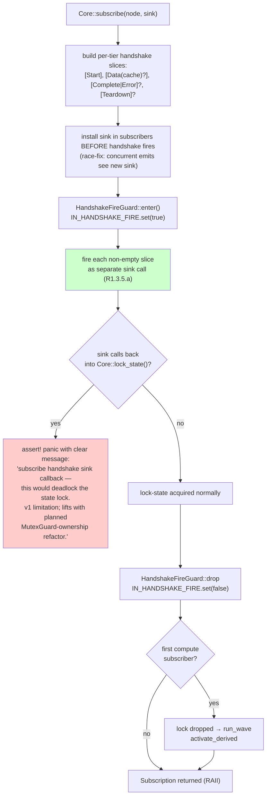

---

## Batch 2 — Wave engine

### 2.1 `run_wave` / `begin_batch` RAII flow (Slice C-1.5 / Slice A close /qa Q2)

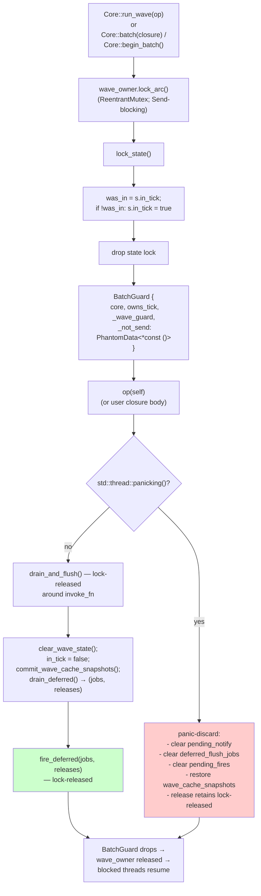

🟦 `BatchGuard` is `!Send` — `compile_fail` doctest enforces. Sending across threads would clear `in_tick` from a thread that didn't set it, and `parking_lot::ReentrantMutex` requires same-thread release.

---

### 2.2 `fire_fn` three-phase (Slice A close lock-released `invoke_fn`)

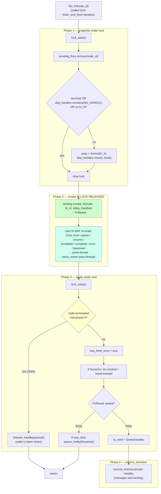

---

### 2.3 `commit_emission` with lock-released `custom_equals` + cache-race fix (P3)

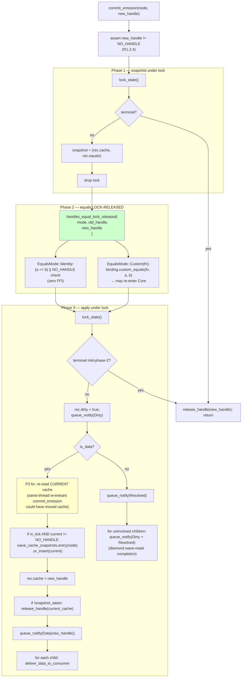

🟨 **D5 deferred:** `is_data` is computed in phase 2 against `(old_handle, new_handle)`; if a same-thread nested commit advances cache between phase 1 and phase 3, `is_data` may be stale. For Identity equals: benign duplicate Data. For Custom equals racing same-node: undefined.

---

### 2.4 `pick_next_fire` transitive walk (Slice C-1.5 diamond glitch fix)

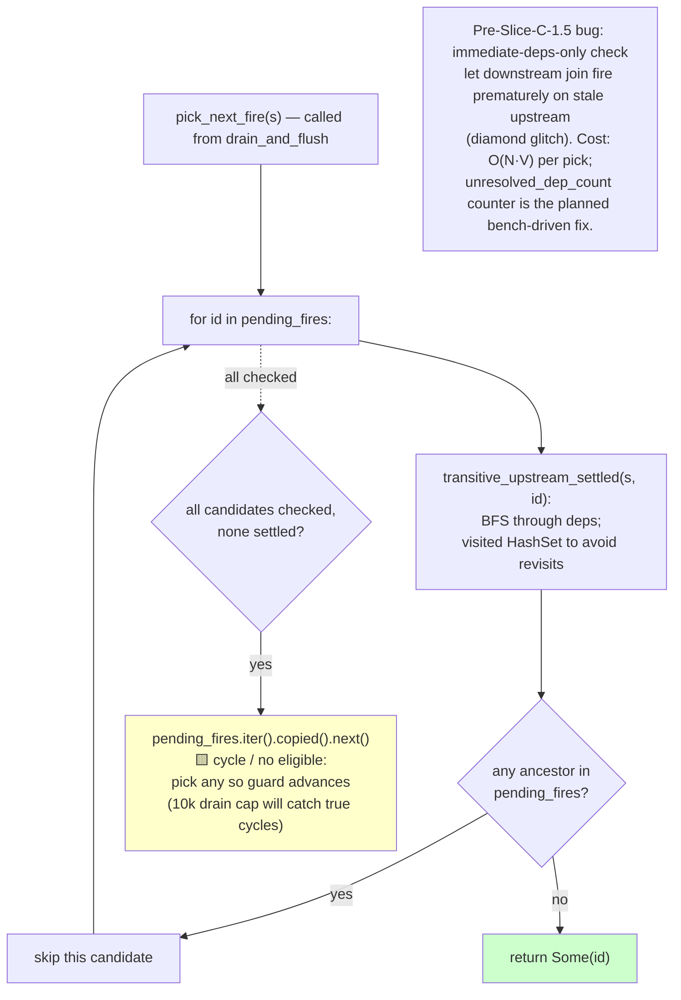

---

### 2.5 `flush_notifications` two-phase by tier (Slice C-1.5 R1.3.1.b)

🟦 Cross-node ordering preserves "phase 1 (DIRTY) propagates through entire graph before phase 2 (DATA/RESOLVED) begins" by tier-then-node iteration over a single `IndexMap`. No separate per-tier queues like TS's drainPhase.

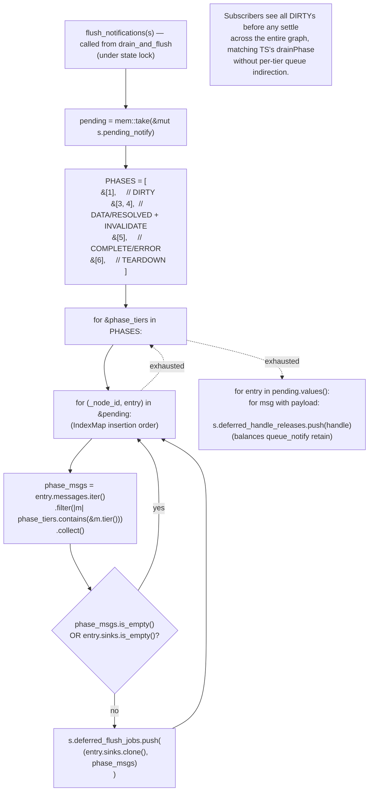

---

### 2.6 `queue_notify` pause routing + sink-snapshot-on-first-touch (Slice A close)

```mermaid
flowchart TB
    Entry["queue_notify(s, node, msg)"]
    BufferedTier{"msg.tier() in &#123;3, 4&#125;?"}
    NoSubs{"rec.subscribers.is_empty()?"}
    Return1["return (no subscribers)"]
    Paused{"rec.pause_state.is_paused()<br/>AND buffered_tier?"}
    PauseRetain["if msg.payload_handle():<br/>binding.retain_handle(h)"]
    PausePush["pause_state.push_buffered(msg, cap)<br/>→ overflow drops oldest;<br/>release dropped payloads"]
    NormalRetain["if msg.payload_handle():<br/>binding.retain_handle(h)"]
    NeedsSnapshot{"pending_notify<br/>contains_key(node)?"}
    BuildSnapshot["sinks_snapshot =<br/>rec.subscribers.values().cloned().collect()"]
    EmptySnapshot["sinks_snapshot = Vec::new()"]
    EntryMatch{"pending_notify.entry(node)?"}
    Vacant["insert PendingPerNode {<br/>  sinks: snapshot,<br/>  messages: vec![msg]<br/>}"]
    Occupied["push msg into existing<br/>entry.messages<br/>(reuse first-touch snapshot)"]

    Entry --> BufferedTier
    BufferedTier --> NoSubs
    NoSubs -- "yes" --> Return1
    NoSubs -- "no" --> Paused
    Paused -- "yes" --> PauseRetain
    PauseRetain --> PausePush
    PausePush --> Return2["return"]
    Paused -- "no" --> NormalRetain
    NormalRetain --> NeedsSnapshot
    NeedsSnapshot -- "yes" --> BuildSnapshot
    NeedsSnapshot -- "no" --> EmptySnapshot
    BuildSnapshot --> EntryMatch
    EmptySnapshot --> EntryMatch
    EntryMatch -- "Vacant" --> Vacant
    EntryMatch -- "Occupied" --> Occupied

    note["First-touch snapshot prevents duplicate-Data delivery<br/>when a late subscriber installed mid-wave between<br/>fn-fire iterations would otherwise see [Start, Data(post)]<br/>from handshake AND [Dirty, Data(post)] from wave flush."]
```

🟨 **D2 deferred:** the snapshot freezes at FIRST `queue_notify`. A subscriber installed BETWEEN two emits to the same node in one wave misses emit #2's flush. Niche scenario; Q1 punt; revisit alongside DS-14.

---

### 2.7 `BatchGuard` panic-discard + cache snapshot restore (Slice A-bigger /qa)

🟦 Atomicity guarantee covers BOTH sink-observability AND cache state. Without the cache-snapshot restore, a panicking `Core::batch` closure would leave state-node caches partially advanced.

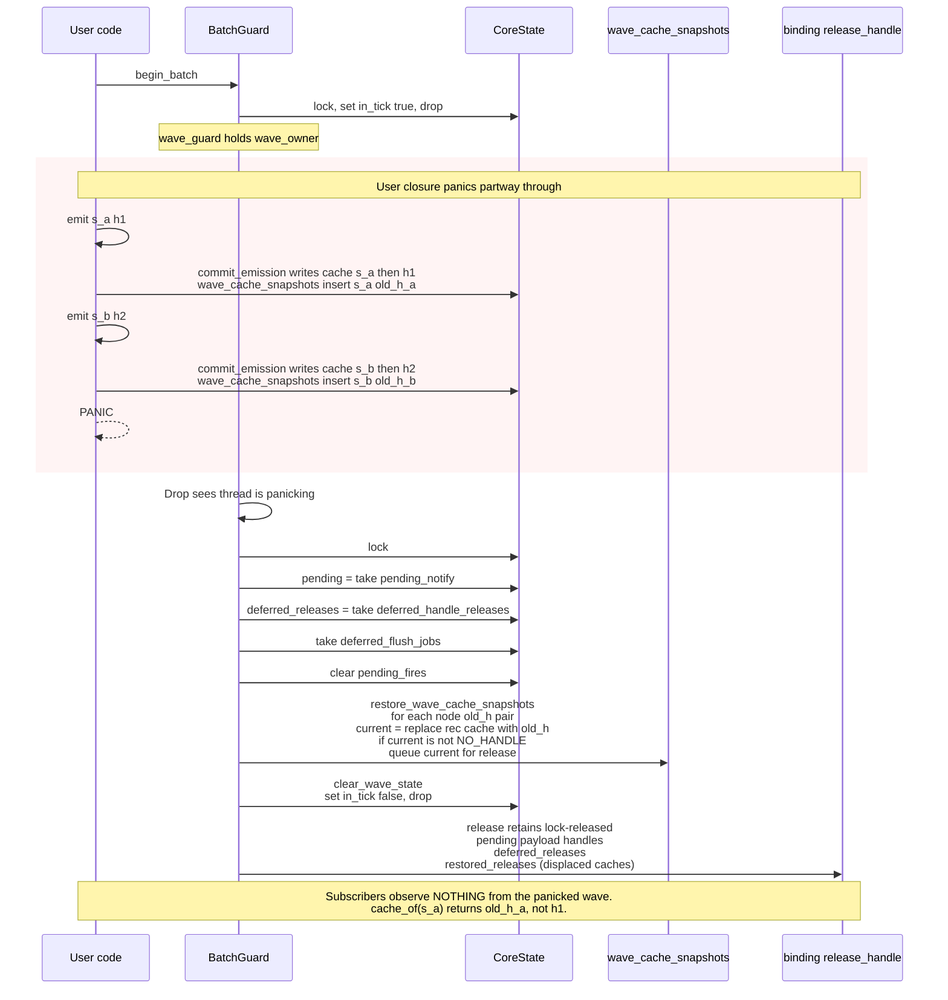

---

## Batch 3 — Lifecycle

### 3.1 Subscribe protocol with R1.3.5.a per-tier handshake split (Slice A close)

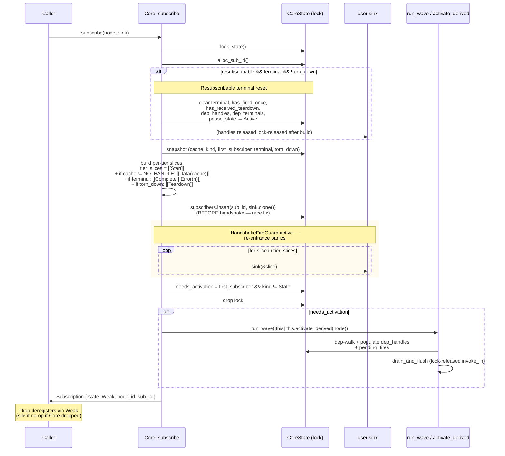

---

### 3.2 `activate_derived` two-phase DFS (Slice A close)

🟦 Replaces TS's recursive `_activate` with explicit two-phase: discover (post-order DFS via Vec stack) → deliver (forward iteration, per-dep `deliver_data_to_consumer`).

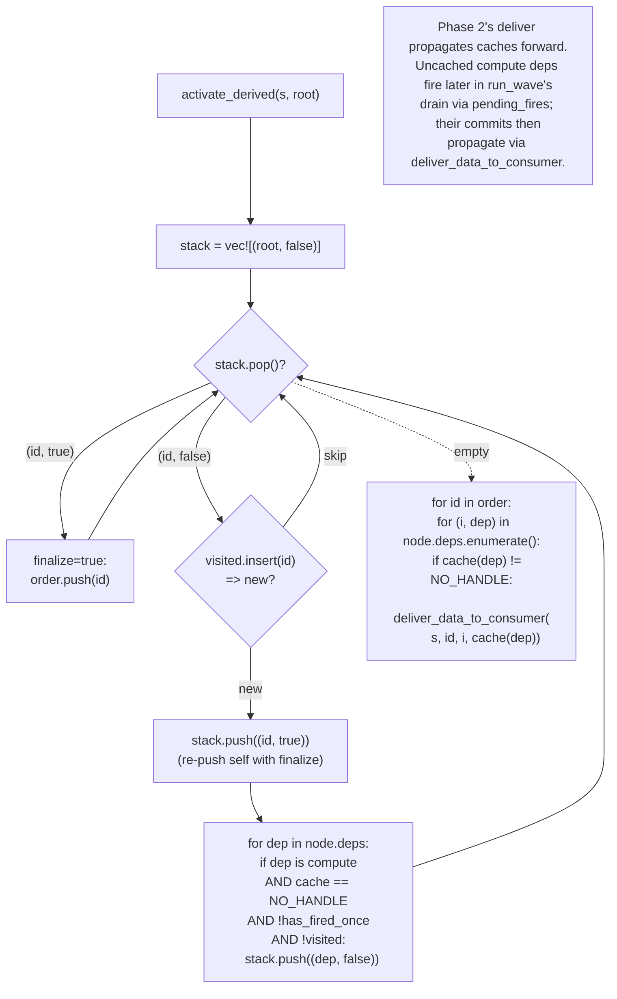

---

### 3.3 Terminal cascade — `terminate_node` iterative + Lock 2.B auto-cascade (Slice A-bigger)

🟦 Iterative work-queue replaces TS recursion. Linear chains of 5000 nodes cascade without stack overflow (verified `tests/cascade_depth.rs`).

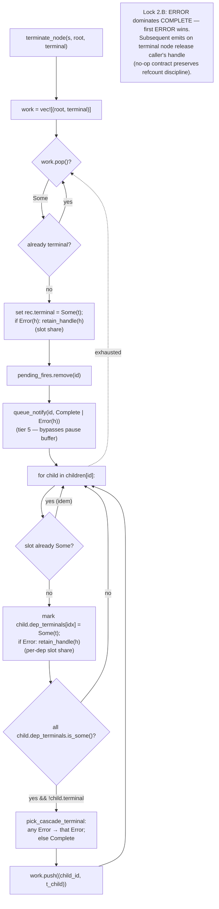

---

### 3.4 `teardown_inner` iterative with R1.3.9.d meta ordering (Slice A-bigger)

The R1.3.9.d "metas first, then self, then children" ordering is preserved by an explicit `Visit` / `EmitTeardown` action stack.

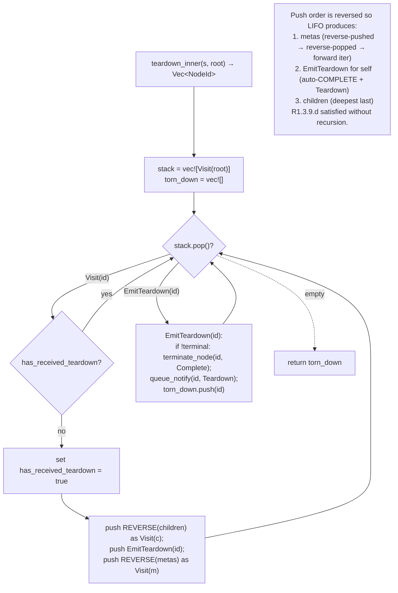

---

### 3.5 INVALIDATE cascade iterative (Slice A-bigger)

R1.4 idempotency-within-wave is naturally provided by the `cache == NO_HANDLE` already-invalidated guard.

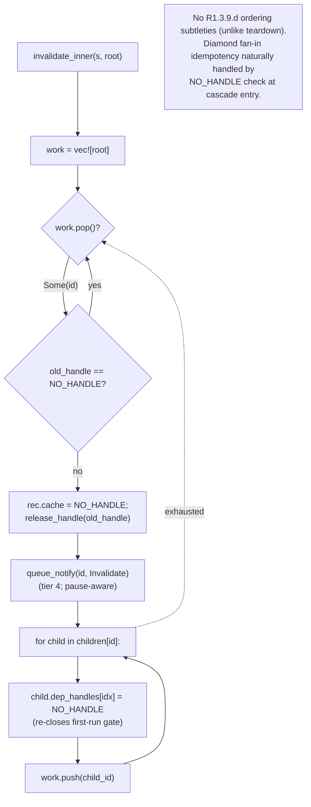

---

### 3.6 `set_deps` atomic dep mutation (TLA+ verified; Phase 13.8 Q1 + Slice A close /qa P2)

```mermaid
flowchart TB
    Entry["Core::set_deps(n, new_deps)"]

    subgraph Validate["Validation phase (under lock)"]
        ExistCheck{"n exists?"}
        ComputeCheck{"kind != State?"}
        TermCheck{"n.terminal.is_some()?"}
        SelfCheck{"new_deps.contains(n)?"}
        DepsExistCheck{"all new_deps registered?"}
        CycleCheck{"path_from_to(n, added_dep)<br/>via children edges<br/>=&gt; cycle?"}
        Q1Check{"added dep is terminal<br/>AND !resubscribable?"}
        Idem{"new_deps == current?"}
    end

    subgraph Mutate["Mutation phase (still under lock)"]
        BuildHandles["new_dep_handles preserves<br/>kept-dep handles by NodeId map"]
        BuildTerms["new_dep_terminals preserves<br/>kept-dep terminals"]
        F1Collect["F1: collect Error handles<br/>from REMOVED dep_terminal slots<br/>(must release; otherwise leaks)"]
        WriteDeps["rec.deps = new_deps;<br/>rec.dep_handles = ...;<br/>rec.dep_terminals = ...;<br/>if Derived: tracked = (0..n);<br/>if Dynamic: tracked.clear() +<br/>has_fired_once = false"]
        Children["children map update:<br/>remove inverted edges for removed,<br/>insert for added"]
        Snapshot["snapshot old_deps_vec,<br/>added_for_wave"]
        DropLock["drop lock"]
    end

    subgraph Wave["Push-on-add phase (lock-released entry)"]
        FireTopo["fire_topology_event(<br/>  DepsChanged { node, old, new }<br/>)"]
        RunWave{"added_for_wave.is_empty()?"}
        InsideClosure["run_wave(|this| {<br/>  re-acquire lock<br/>  defensive: n exists &amp; not terminal?<br/>  for added_dep:<br/>    re-read cache UNDER wave-owner lock<br/>    (P2 fix: prevents dangling HandleId)<br/>    if cache != NO_HANDLE:<br/>      deliver_data_to_consumer(n, idx, cache)<br/>})"]
        ReleaseRemoved["for h in removed_terminal_handles:<br/>release_handle(h)"]
    end

    Entry --> ExistCheck
    ExistCheck -- "no" --> ErrUnknown["Err(UnknownNode)"]
    ExistCheck -- "yes" --> ComputeCheck
    ComputeCheck -- "no" --> ErrCompute["Err(NotComputeNode)"]
    ComputeCheck -- "yes" --> TermCheck
    TermCheck -- "yes" --> ErrTerm["Err(TerminalNode)"]
    TermCheck -- "no" --> SelfCheck
    SelfCheck -- "yes" --> ErrSelf["Err(SelfDependency)"]
    SelfCheck -- "no" --> DepsExistCheck
    DepsExistCheck -- "no" --> ErrUnknown
    DepsExistCheck -- "yes" --> CycleCheck
    CycleCheck -- "yes" --> ErrCycle["Err(WouldCreateCycle)"]
    CycleCheck -- "no" --> Q1Check
    Q1Check -- "yes" --> ErrTermDep["Err(TerminalDep)"]
    Q1Check -- "no" --> Idem
    Idem -- "yes" --> Ok1["Ok(()) — fast path"]
    Idem -- "no" --> BuildHandles
    BuildHandles --> BuildTerms
    BuildTerms --> F1Collect
    F1Collect --> WriteDeps
    WriteDeps --> Children
    Children --> Snapshot
    Snapshot --> DropLock
    DropLock --> FireTopo
    FireTopo --> RunWave
    RunWave -- "no (added)" --> InsideClosure
    RunWave -- "yes" --> ReleaseRemoved
    InsideClosure --> ReleaseRemoved
    ReleaseRemoved --> Ok2["Ok(())"]

    style F1Collect fill:#cfc
    style InsideClosure fill:#ffc

    note["TLA+ verified: docs/research/wave_protocol_rewire.tla<br/>35,950 distinct states; all 7 invariants clean."]
```

🟨 **D1 deferred:** re-entrant `set_deps(n)` from inside `n`'s own firing fn corrupts Dynamic `tracked` indices. `Graph::set_deps` widens this surface (Slice E+); rustdoc `# Hazards` is the only mitigation today.

---

## Batch 4 — Drop / refcount discipline

### 4.1 `Drop for CoreState` — full handle-release walk (Slice A-bigger /qa)

🟦 Without this, every retained handle in `cache` / `terminal` Error / `dep_terminals` Error / pause-buffer-payload leaked in the binding registry until process exit.

```mermaid
flowchart TB
    Entry["impl Drop for CoreState::drop"]
    DrainPending["pending = take(pending_notify);<br/>release each msg.payload_handle()"]
    DrainDeferred["deferred_releases = take(deferred_handle_releases);<br/>release each"]
    DropFlush["take(deferred_flush_jobs)<br/>(Sink Arcs drop naturally)"]
    NodeWalk["for rec in nodes.values():"]
    Cache["if rec.cache != NO_HANDLE:<br/>release_handle(cache)"]
    Term["if let Some(Error(h)) = rec.terminal:<br/>release_handle(h)"]
    DepTerms["for slot in dep_terminals:<br/>if Some(Error(h)): release_handle(h)"]
    PauseBuf["if Paused { buffer, .. }:<br/>for msg in buffer:<br/>release each payload_handle()"]
    Snapshots["take(wave_cache_snapshots);<br/>release each snapshotted handle<br/>(defensive — should be empty<br/>in success path)"]

    Entry --> DrainPending
    DrainPending --> DrainDeferred
    DrainDeferred --> DropFlush
    DropFlush --> NodeWalk
    NodeWalk --> Cache
    Cache --> Term
    Term --> DepTerms
    DepTerms --> PauseBuf
    PauseBuf -. next node .-> NodeWalk
    NodeWalk -. exhausted .-> Snapshots

    note["Safe to call during panic unwinding —<br/>release_handle is the only call,<br/>and a panicking binding during cleanup<br/>was already broken."]
```

---

### 4.2 Refcount discipline across slot types

Where each handle's refcount share lives, who retains it, who releases it.

| Slot | Retained by | Released by |
|------|-------------|-------------|
| `cache: HandleId` | `commit_emission` phase 3 (transfers caller's intern share) | `commit_emission` when displaced; `invalidate_inner`; `Drop for CoreState` |
| `terminal: Some(Error(h))` | `terminate_node` `retain_handle(h)` | `reset_for_fresh_lifecycle` (resubscribable); `Drop for CoreState` |
| `dep_terminals[i]: Some(Error(h))` | `terminate_node` per child slot | `set_deps` F1 fix (removed dep slot); `reset_for_fresh_lifecycle`; `Drop for CoreState` |
| `pause_state.buffer` payload | `queue_notify` `retain_handle(h)` | `resume` after sink fire; overflow drop; `reset_for_fresh_lifecycle`; `Drop for CoreState` |
| `pending_notify[node].messages` payload | `queue_notify` `retain_handle(h)` | `flush_notifications` → `deferred_handle_releases` → `fire_deferred`; `BatchGuard` panic-discard; `Drop for CoreState` |
| `wave_cache_snapshots[node]` | `commit_emission` phase 3 (first commit per node per wave) | `commit_wave_cache_snapshots` (success); `restore_wave_cache_snapshots` (panic — transferred to cache slot); `Drop for CoreState` |
| `caller's intern share` (entry-point arg) | binding's `intern(value)` | `Core::emit` short-circuit on terminal; `Core::error` always; `commit_emission` short-circuit on terminal |

---

## Batch 5 — Topology + Graph container (M2)

### 5.1 `subscribe_topology` + `TopologyEvent` (Slice F)

```mermaid
classDiagram
    class TopologyEvent {
        <<enum>>
        NodeRegistered
        NodeTornDown
        DepsChanged
    }
    class TopologySink {
        <<typeAlias>>
    }
    class TopologySubscription {
        -id
        -state
        +Drop
    }
    class Core {
        +subscribe_topology(sink) TopologySubscription
        +fire_topology_event(event)
    }
    Core --> TopologySink : sinks
    Core ..> TopologyEvent : fires
    TopologySubscription ..> Core : Weak ref
```

**Variant payloads:**
- `TopologyEvent::NodeRegistered(NodeId)`
- `TopologyEvent::NodeTornDown(NodeId)`
- `TopologyEvent::DepsChanged { node, old_deps, new_deps }`

**Type aliases / fields:**
- `TopologySink = Arc<dyn Fn(&TopologyEvent) + Send + Sync>`
- `TopologySubscription { id: u64, state: Weak<Mutex<CoreState>> }`
- `Drop` impl: silent no-op if Core gone; else `topology_sinks.remove(id)`.
- `Core::fire_topology_event` is `pub(crate)`.

```mermaid
flowchart LR
    Reg["Core::register_state /<br/>register_computed"] -. "after lock drop" .-> RegEvent["NodeRegistered(id)"]
    TD["Core::teardown"] -. "for root + each cascaded id<br/>(meta + downstream)" .-> TDEvent["NodeTornDown(id)"]
    SD["Core::set_deps"] -. "after lock drop, only if<br/>actually rewired (not idempotent)" .-> DCEvent["DepsChanged { ... }"]
    RegEvent --> Sinks["all topology_sinks fire<br/>OUTSIDE state lock"]
    TDEvent --> Sinks
    DCEvent --> Sinks

    note["NodeRegistered fires BEFORE Graph::add inserts the name —<br/>sinks calling graph.name_of(id) see None.<br/>Graph-layer namespace_change hook covers that gap."]
```

---

### 5.2 Graph + GraphInner shape (Slice D + E+)

```mermaid
classDiagram
    class Graph {
        +core
        +inner
        +new(name, binding) Graph
        +clone() Graph
        +core() readonly
    }
    class GraphInner {
        <<lockProtected>>
        +name
        +names
        +names_inverse
        +children
        +parent
        +destroyed
        +namespace_sinks
        +next_ns_sink_id
    }
    Graph --> GraphInner : Arc Mutex
    Graph ..> Graph : children mounted

    note for Graph "Lock acquisition rule: Graph then Core only, never Core then Graph. Two-graph operations like mount: parent then child."
```

**Field types:**

| Class | Field | Type |
|-------|-------|------|
| `Graph` | `core` | `Core` (Arc-cloned) |
| `Graph` | `inner` | `Arc<Mutex<GraphInner>>` |
| `GraphInner` | `name` | `String` |
| `GraphInner` | `names` | `IndexMap<String, NodeId>` |
| `GraphInner` | `names_inverse` | `IndexMap<NodeId, String>` |
| `GraphInner` | `children` | `IndexMap<String, Graph>` |
| `GraphInner` | `parent` | `Option<Weak<Mutex<GraphInner>>>` (cycle break) |
| `GraphInner` | `destroyed` | `bool` |
| `GraphInner` | `namespace_sinks` | `IndexMap<u64, NamespaceChangeSink>` |
| `GraphInner` | `next_ns_sink_id` | `u64` |

🟦 `Weak<Mutex<GraphInner>>` for `parent` is Rust-specific compile-time cycle prevention (TS uses a strong ref + manual cycle break).

---

### 5.3 Mount lock ordering + TOCTOU fix (Slice E+ /qa B1)

```mermaid
sequenceDiagram
    participant U as User
    participant P as parent.inner
    participant Ch as child.inner
    participant Core
    participant NSink as namespace_sinks

    U->>P: mount(name, child)
    Note over P: validate `::` separator
    P->>Core: parent.core.same_dispatcher(&child.core)?
    Core-->>P: Arc::ptr_eq result
    alt different Core
        P-->>U: Err(MountError::CoreMismatch)
    end

    rect rgba(255, 240, 200, 0.3)
        Note over P,Ch: B1 fix — hold parent lock across<br/>validation + child-lock acquisition + insert
        P->>P: parent_inner.lock()
        P->>P: destroyed? children.contains? names.contains?
        P->>Ch: child_inner.lock()
        P->>Ch: child.parent.is_some()?
        alt already mounted
            P-->>U: Err(MountError::AlreadyMounted)
        end
        P->>Ch: child.parent = Some(weak(parent.inner))
        P->>P: parent_inner.children.insert(name, child)
        P->>Ch: drop child lock
        P->>P: drop parent lock
    end

    P->>NSink: parent.fire_namespace_change()<br/>(P3 fix from /qa Slice F:<br/>reactive describe / observe_all<br/>see mount as namespace change)
    P-->>U: Ok(child)

    Note over U,NSink: Lock order: parent → child. No Graph code<br/>acquires parent from inside child.
```

---

### 5.4 `destroy()` reorder (Slice E+ /qa B3)

R3.7.3 ordering: namespace MUST stay intact during the TEARDOWN cascade so sinks observing `[Teardown]` can resolve names via `name_of` / `try_resolve`.

```mermaid
flowchart TB
    Entry["Graph::destroy()"]
    Lock["lock inner"]
    Idem{"already destroyed?"}
    SetDestroyed["destroyed = true"]
    SnapshotIds["snapshot:<br/>own_ids = names.values()<br/>kids = children.values().cloned()"]
    DropLock["drop lock"]
    RecurseKids["for kid in kids:<br/>kid.destroy() (recursive)"]
    TeardownOwn["for id in own_ids:<br/>core.teardown(id)<br/>(sinks resolve names mid-cascade)"]
    LockClear["re-lock inner"]
    ClearReg["names.clear();<br/>names_inverse.clear();<br/>children.clear()"]
    DropLock2["drop lock"]
    FireNS["fire_namespace_change()<br/>(reactive describe sees clear)"]

    Entry --> Lock
    Lock --> Idem
    Idem -- "yes" --> Ret["return"]
    Idem -- "no" --> SetDestroyed
    SetDestroyed --> SnapshotIds
    SnapshotIds --> DropLock
    DropLock --> RecurseKids
    RecurseKids --> TeardownOwn
    TeardownOwn --> LockClear
    LockClear --> ClearReg
    ClearReg --> DropLock2
    DropLock2 --> FireNS

    style TeardownOwn fill:#cfc
    style ClearReg fill:#ffc

    note["Pre-B3 order cleared registries first, so sinks<br/>observing TEARDOWN saw an empty namespace.<br/>Regression test: destroy_preserves_namespace_during_teardown_cascade."]
```

---

## Batch 6 — Read-side surface (Slice E+)

### 6.1 Namespace path resolution (`try_resolve`)

```mermaid
flowchart TB
    Entry["graph.try_resolve(path)"]
    Split["segments = path.split(::)"]
    First["first = segments.next()?"]
    Lock["lock inner"]
    HasRest{"path has<br/>::-suffix?"}
    LookupChild["children.get(first)?<br/>→ subgraph"]
    DropLock["drop lock"]
    Recurse["child.try_resolve(rest)"]
    LocalLookup["names.get(first).copied()"]

    Entry --> Split
    Split --> First
    First --> Lock
    Lock --> HasRest
    HasRest -- "yes (e.g. 'mount::node')" --> LookupChild
    LookupChild --> DropLock
    DropLock --> Recurse
    HasRest -- "no" --> LocalLookup
    Recurse --> Ret1["Option&lt;NodeId&gt;"]
    LocalLookup --> Ret2["Option&lt;NodeId&gt;"]

    note["🟨 Deferred: '..::sibling::node' (cross-subgraph<br/>relative paths per R3.5.2). v1 only supports<br/>root-relative descent.<br/>🟨 Deferred: malformed paths ('::foo', 'foo::',<br/>'a::::b') silently return None — no PathError."]
```

---

### 6.2 `describe()` JSON build (Slice E+ + /qa B4)

```mermaid
flowchart TB
    Entry["graph.describe()"]
    Lock["lock inner"]
    SnapshotNS["local_names: IndexMap&lt;NodeId, String&gt;<br/>names_iter: Vec&lt;(name, id)&gt;<br/>subgraphs: Vec&lt;String&gt;"]
    DropLock["drop lock<br/>(no Graph lock during Core probes)"]
    Iterate["for (name, id) in names_iter:"]
    Probes["core.kind_of(id)<br/>core.cache_of(id)<br/>core.is_terminal(id)<br/>core.is_dirty(id)<br/>core.has_fired_once(id)<br/>core.deps_of(id)<br/>(each = single Core lock)"]
    DepNames["dep_names: lookup local_names<br/>or fallback to '_anon_&lt;id&gt;'"]
    EdgeBuild["edges.push(EdgeDescribe { from, to })"]
    StatusOf["status_of(kind, cache, terminal,<br/>dirty, fired):<br/>errored &gt; completed &gt; dirty &gt;<br/>settled &gt; pending &gt; sentinel"]
    BuildNode["NodeDescribe {<br/>  type, status,<br/>  value: Option&lt;HandleId&gt; (skip None),<br/>  deps: dep_names,<br/>  meta: None (B4 reserved field)<br/>}"]
    Insert["nodes.insert(name, NodeDescribe)"]
    BuildOut["GraphDescribeOutput {<br/>  name, nodes (insertion order),<br/>  edges, subgraphs<br/>}"]

    Entry --> Lock
    Lock --> SnapshotNS
    SnapshotNS --> DropLock
    DropLock --> Iterate
    Iterate --> Probes
    Probes --> DepNames
    DepNames --> EdgeBuild
    EdgeBuild --> StatusOf
    StatusOf --> BuildNode
    BuildNode --> Insert
    Insert --> Iterate
    Iterate -. exhausted .-> BuildOut

    note["🟨 value: Option&lt;HandleId&gt; surfaces raw u64,<br/>not user-rendered T (cleaving plane divergence).<br/>Bindings provide describe_with_values wrapper.<br/>Mounted children's nodes NOT inlined —<br/>recurse via graph.node(child).describe() per Q4."]
```

---

### 6.3 `observe()` / `observe_all()` shape (Slice E+ default + Slice F reactive)

```mermaid
classDiagram
    class GraphObserveOne {
        -graph
        -node_id
        +subscribe(sink) Subscription
        +pause(lock)
        +resume(lock)
        +invalidate()
    }
    class GraphObserveAll {
        -graph
        -subs
        +subscribe(sink) usize
    }
    class GraphObserveAllReactive {
        -graph
        -ns_sink_id
        -inner
        +subscribe(sink)
    }
    class ObserveAllReactiveInner {
        +subscribed
        +subs
    }

    GraphObserveAllReactive --> ObserveAllReactiveInner : Arc Mutex

    note for GraphObserveOne "R3.6.2 divergence (F12): Canonical up(messages); Rust decomposes to pause(lock) / resume(lock) / invalidate() to avoid Vec allocation per upstream call."
    note for GraphObserveAll "Snapshot-at-subscribe-time: nodes added AFTER subscribe not auto-subscribed. Use observe_all_reactive for dynamic membership."
```

**Field types and Drop semantics:**

| Class | Field / signature | Type / behavior |
|-------|-------------------|-----------------|
| `GraphObserveOne` | `graph` | `Graph` |
| `GraphObserveOne` | `node_id` | `NodeId` |
| `GraphObserveOne` | `pause(lock)` | `Result<(), PauseError>` |
| `GraphObserveOne` | `resume(lock)` | `Result<Option<ResumeReport>, PauseError>` |
| `GraphObserveAll` | `subs` | `Vec<Subscription>` |
| `GraphObserveAll` | `subscribe<F>(sink)` | generic over closure type |
| `GraphObserveAll` | `Drop` | drops all `Subscription`s in vec |
| `GraphObserveAllReactive` | `ns_sink_id` | `Option<u64>` |
| `GraphObserveAllReactive` | `inner` | `Arc<Mutex<ObserveAllReactiveInner>>` |
| `GraphObserveAllReactive` | `Drop` | unsubscribe namespace sink BEFORE `inner` drops (deadlock prevention) |
| `ObserveAllReactiveInner` | `subscribed` | `HashSet<NodeId>` |
| `ObserveAllReactiveInner` | `subs` | `Vec<Subscription>` |

---

## Batch 7 — M3 Slice A + B (DepRecord wave-end rotation + FnResult::Batch)

### 7.1 NodeRecord shape after M3 (`src/node.rs`)

Slice A swapped the parallel `deps: Vec<NodeId>` / `dep_handles: Vec<HandleId>` / `dep_terminals: Vec<TerminalKind>` triplet for a single `dep_records: Vec<DepRecord>`. Slice B added `partial`, `pending_auto_resolve`, and `op_scratch` fields. Slice E1 added `replay_buffer`. Slice F added `pausable_mode`. Slice G added `tier3_emitted_this_wave` (CoreState-level).

```mermaid
classDiagram
    class NodeRecord {
        +Vec~DepRecord~ dep_records
        +Option~FnId~ fn_id
        +Option~OperatorOp~ op
        +bool is_dynamic
        +bool partial
        +EqualsMode equals_mode
        +PausableMode pausable_mode
        +bool resubscribable
        +Option~Box~OperatorScratch~~ op_scratch
        +VecDeque~HandleId~ replay_buffer
        +Option~usize~ replay_buffer_cap
        +Option~PendingAutoResolve~ pending_auto_resolve
        +HandleId cache_handle
        +Vec~Subscriber~ subscribers
        +Status status
        +bool skips_auto_cascade
        +kind() NodeKind
    }
    class DepRecord {
        +NodeId node_id
        +HandleId latest_handle
        +TerminalKind terminal
        +VecDeque~HandleId~ data_batch
        +bool involved_in_wave
    }
    class CoreState {
        +AHashSet~NodeId~ tier3_emitted_this_wave
        +AHashSet~NodeId~ pending_fires
        +IndexMap~NodeId, NotifyEntry~ pending_notify
        +AHashSet~NodeId~ invalidate_hooks_fired_this_wave
    }
    NodeRecord o-- DepRecord
    NodeRecord ..> CoreState
    note for NodeRecord "kind() derived from\n(deps.is_empty(), fn_id, op, is_dynamic)\n— D030 NodeKind drop refactor"
    note for CoreState "tier3_emitted_this_wave is\nSlice G — gates equals/auto-resolve\nto prevent R1.3.2.d violation"
```

🟦 **Rust delta vs TS:** TS holds parallel arrays inside `NodeImpl` closures; Rust packs everything into one struct because lock-acquired access wants a single Vec walk. The `kind()` method derivation (D030) mirrors TS exactly — TS `NodeImpl` has no `_kind` field either.

🟨 **v1 limitation (5.4 INVALIDATE / pending_pause_overflow):** Pause-overflow ERROR synthesis (Slice F) clears `pending_pause_overflow` on panic-unwind, silently dropping queued ERROR. Documented divergence — see `porting-deferred.md` "pending_pause_overflow cleared on panic-unwind."

---

### 7.2 DepRecord wave-end rotation (R1.3.6.b)

When a dep emits multiple Data messages in a single wave, they coalesce into `data_batch: VecDeque<HandleId>`. At wave end, the most-recent Data is rotated out as `latest_handle` and the rest of the batch is exposed to the firing fn as `&[DepBatch]` per `R1.3.6.b`.

```mermaid
sequenceDiagram
    participant Caller
    participant Core
    participant State as CoreState (LOCKED)
    participant DR as DepRecord (in NodeRecord)

    Note over Caller,DR: Slice A: per-dep batch accumulation

    Caller->>Core: emit(dep, h1)
    activate Core
    Core->>State: lock_state()
    State->>DR: data_batch.push_back(h1)
    State->>DR: involved_in_wave = true
    Note over DR: data_batch = [h1]
    deactivate Core

    Caller->>Core: emit(dep, h2)
    activate Core
    Core->>State: lock_state()
    State->>DR: data_batch.push_back(h2)
    Note over DR: data_batch = [h1, h2]
    deactivate Core

    Note over Core,DR: ── wave-end rotation ──
    Core->>Core: drain_wave (after all sources committed)
    Core->>DR: rotate_dep_records()
    Note over DR: latest_handle = h2 (last)<br/>data_batch = [h1] (prefix)<br/>involved_in_wave = false

    Core->>Caller: invoke_fn(&[DepBatch{ data: [h1], latest: h2 }])
    Note over Caller: fn sees prefix + latest split<br/>per R1.3.6.b
```

Cited rules: R1.3.6.a (single-emit accumulation) + R1.3.6.b (multi-emit batch delivery split).

---

### 7.3 `FnResult::Batch` dispatch + `commit_emission_verbatim`

Slice B adds `FnEmission { handle, terminal? }` and `FnResult::Batch(Vec<FnEmission>)` so a single fn-fire can emit a heterogeneous wave (Data, Data, Complete) without re-invoking the fn. `commit_emission_verbatim` skips equals substitution (since the user explicitly chose verbatim), and Slice G later widened it to populate `tier3_emitted_this_wave` so subsequent emits coalesce per R1.3.2.d.

```mermaid
flowchart TD
    Fire["fire_fn / fire_operator returns<br/>FnResult"]
    DispDirect{"FnResult variant?"}
    Single["FnResult::Single(FnEmission)"]
    Batch["FnResult::Batch(Vec~FnEmission~)"]
    EmptyBatch["FnResult::Batch(empty)"]
    None["FnResult::None"]

    Fire --> DispDirect
    DispDirect -->|Single| Single
    DispDirect -->|Batch non-empty| Batch
    DispDirect -->|Batch empty| EmptyBatch
    DispDirect -->|None| None

    Single --> CESingle["commit_emission(handle, terminal?)<br/>(default: applies equals if Identity)"]
    Batch --> Loop["for emission in batch:"]
    Loop --> CEVerbatim["commit_emission_verbatim(handle, terminal?)<br/>+ tier3_emitted_this_wave.insert(node)<br/>(R1.3.2.d hook — Slice G)"]
    Loop -->|next| Loop
    Loop -->|done| AutoResolve

    EmptyBatch --> SettleResolved["settle_dirty_resolved<br/>(F1 fix: empty Batch promotes DIRTY → RESOLVED)<br/>R1.3.3.a discharge"]

    None --> Noop["Noop path<br/>+ R1.3.3.a tier3 guard (Slice G)"]

    CESingle --> AutoResolve
    CEVerbatim --> AutoResolve
    AutoResolve{"pending_auto_resolve set?"}
    AutoResolve -->|yes| ARFire["queue_auto_resolved (R1.3.3.b)<br/>— prevents double-settlement<br/>on diamond reconvergence"]
    AutoResolve -->|no| Done["wave continues"]

    style Batch fill:#cfe
    style EmptyBatch fill:#fec
    style ARFire fill:#cfe
```

🟦 **Rust delta vs TS:** TS doesn't expose `commit_emission_verbatim` — its equivalent path lives in `_pump`. Rust splits the verbatim/equals-applying paths because Slice G's R1.3.2.d coalescing requires verbatim emits to participate in `tier3_emitted_this_wave` tracking; TS handles the same invariant via its inner `_emit` closure capturing `currentWaveEmits`.

🟨 **v1 limitation (Slice B /qa F1 — RESOLVED):** Empty `FnResult::Batch` originally left the node DIRTY indefinitely; now settles RESOLVED. See `porting-deferred.md` "Slice B /qa F1."

---

## Batch 8 — M3 operator architecture (Slice C-1 / C-2 / C-3)

### 8.1 `NodeKind::Operator(OperatorOp)` variant table

13 operator variants ship across Slice C-1/C-2/C-3. Each variant participates in dispatch via `fire_operator`, and several opt out of `Lock 2.B auto-cascade` via `NodeKind::skips_auto_cascade()`.

```mermaid
classDiagram
    class OperatorOp {
        <<enumeration>>
        Map(FnId)
        Filter(FnId)
        Scan(FnId, seed: HandleId)
        Reduce(FnId, seed: HandleId)
        DistinctUntilChanged(EqualsMode)
        Pairwise
        Combine(packer: FnId)
        WithLatestFrom(packer: FnId)
        Merge
        Take(count: usize)
        Skip(count: usize)
        TakeWhile(FnId)
        Last(default: Option~HandleId~)
    }
    class NodeKind {
        State
        Producer
        Derived
        Dynamic
        Operator(OperatorOp)
        skips_auto_cascade() bool
    }
    NodeKind --> OperatorOp

    note for NodeKind "skips_auto_cascade returns true for:\n• Operator(Reduce) — emits acc + Complete\n• Operator(Last) — emits last + Complete\n(both intercept upstream COMPLETE per Lock 2.B opt-out)"
    note for OperatorOp "Last default: HandleId is\nrefcounted; released on terminate\n(F4 regression test, Slice H /qa)"
```

🟦 **Rust delta vs TS:** TS represents operators as plain `derived` calls with bespoke fn closures; the spec doesn't require an `OperatorOp` enum. Rust adds the discriminant because `fire_operator` dispatches without going through user fn FFI for built-in operators (zero-FFI `Map` / `Merge` / `Pairwise`). Net win: bench shows the FFI elimination saves ~50 ns/emit.

---

### 8.2 `register_operator` + `make_op_scratch` (Slice H /qa: ScratchReleaseGuard)

Slice H promoted `register_operator` from `assert!` panics to typed `Result<NodeId, RegisterError>`. The /qa pass surfaced a TOCTOU window: previously `make_op_scratch` retained handles BEFORE the state-lock validation phase, so a concurrent `Core::complete(dep)` between the validation and insertion phases could leave scratch retains leaked. `ScratchReleaseGuard` is the RAII fix — declared BEFORE `lock_state()` so it drops AFTER the MutexGuard, releasing any not-armed scratch handles lock-released on unwind or early-return.

```mermaid
sequenceDiagram
    participant User
    participant Core
    participant Scratch as ScratchReleaseGuard
    participant State as CoreState (LOCKED)

    User->>Core: register_operator(deps, op, opts)

    Note over Core: Phase 1 — lock-released validation
    Core->>Core: validate(deps, op, opts) [no side effects]
    alt validation Err
        Core-->>User: Err(RegisterError::Variant) — early return
    else validation OK
        Note over Core: Phase 2 — scratch creation (lock-released)
        Core->>Scratch: make_op_scratch(op, &binding)
        Note over Scratch: Allocates Box~State~ FIRST<br/>then retain_handle(seed) etc<br/>(F13 fix — Box::new panic doesn't leak)

        Note over Core: Phase 3 — state-lock validation + insertion
        Core->>State: let _g = state.lock()
        State->>State: re-check deps still valid<br/>(closes TOCTOU window)
        alt re-check Err
            Note over State,Scratch: drop(state) → drop(Scratch)<br/>release_handles(binding) lock-released
            State-->>Core: Err
            Core-->>User: Err(RegisterError::Variant)
        else re-check OK
            State->>State: nodes.insert(NodeRecord)<br/>op_scratch = Some(scratch.disarm())
            Note over Scratch: disarm — Drop becomes no-op<br/>(scratch owned by NodeRecord)
            State-->>Core: NodeId
            Core-->>User: Ok(NodeId)
        end
    end
```

Cited rules: D047 / D048 (Slice H typed-error decisions) + Slice H /qa F1 + F2 + F13.

🟦 **Rust delta vs TS:** TS doesn't have a TOCTOU concern because its lock surface is single-threaded (per-Core JS event loop). Rust's `Mutex<CoreState>` admits concurrent acquirers, so the LIFO drop order (`Scratch` declared before `state` lock → `state` drops first → `Scratch` drops lock-released) is the only safe ordering.

---

### 8.3 `fire_operator` dispatch tree

Once `NodeRecord.kind()` returns `NodeKind::Operator(op)`, `fire_operator` dispatches by the variant. All operators access state via `op_scratch_mut::<TheState>()` (D026). Combine / WithLatestFrom / Merge consult `snapshot_op_all_latest` for multi-dep snapshots.

```mermaid
flowchart TD
    Fire["fire_operator(node, op, dep_records, fired_dep_idx)"]
    Disp{"OperatorOp variant?"}
    Fire --> Disp

    Disp -->|Map| FMap["zero-FFI: emit(latest_handle)"]
    Disp -->|Filter| FFilter["BindingBoundary::predicate_each<br/>→ emit if true"]
    Disp -->|Scan| FScan["op_scratch_mut::~ScanState~<br/>fold_each(acc, latest)<br/>→ emit new_acc"]
    Disp -->|Reduce| FReduce["op_scratch_mut::~ReduceState~<br/>buffer fold; emit only on COMPLETE<br/>(skips_auto_cascade)"]
    Disp -->|DistinctUntilChanged| FDist["op_scratch_mut::~DistinctState~<br/>compare prev via EqualsMode<br/>→ emit if differs"]
    Disp -->|Pairwise| FPair["op_scratch_mut::~PairwiseState~<br/>pairwise_pack(prev, latest)"]

    Disp -->|Combine| FComb["snapshot_op_all_latest()<br/>+ post-warmup INVALIDATE NO_HANDLE guard<br/>→ pack_tuple → emit"]
    Disp -->|WithLatestFrom| FWLF["fired_dep_idx == 0?<br/>(primary fires only)<br/>+ first-fire gate-release<br/>(D021)"]
    Disp -->|Merge| FMerge["zero-FFI: forward latest_handle<br/>(no FFI hop)"]

    Disp -->|Take| FTake["op_scratch_mut::~TakeState~<br/>count down; emit + maybe self-complete"]
    Disp -->|Skip| FSkip["op_scratch_mut::~SkipState~<br/>count down; emit only after threshold"]
    Disp -->|TakeWhile| FTW["BindingBoundary::predicate_each<br/>true → emit; false → self-complete"]
    Disp -->|Last| FLast["op_scratch_mut::~LastState~<br/>buffer last DATA; emit on COMPLETE<br/>(skips_auto_cascade; default fallback if empty)"]

    style FReduce fill:#cfe
    style FLast fill:#cfe
    style FMap fill:#fec
    style FMerge fill:#fec
```

🟦 **Rust delta vs TS:** zero-FFI paths (`Map`, `Merge`) are the headline win. TS pays full FFI cost for every operator call.

🟨 **v1 limitation:** `OperatorOpts.equals` is a no-op for transform operators — the `equals` mode applies only to `DistinctUntilChanged`. See `porting-deferred.md` "OperatorOpts.equals no-op for transform."

---

### 8.4 `OperatorScratch` trait + 8 concrete state structs (Slice C-3 D026)

`op_scratch: Option<Box<dyn OperatorScratch>>` replaced the typed `operator_state: HandleId` field. The trait carries `release_handles(&dyn BindingBoundary)` so refcount discipline lives next to the state. `make_op_scratch(op)` is the shared constructor used by both `register_operator` and `reset_for_fresh_lifecycle` (resubscribable terminal cycle).

```mermaid
classDiagram
    class OperatorScratch {
        <<trait>>
        +release_handles(binding: &dyn BindingBoundary)
        +as_any_mut(&mut self) &mut dyn Any
    }
    class ScanState {
        +HandleId acc
    }
    class ReduceState {
        +HandleId acc
        +bool has_value
    }
    class DistinctState {
        +Option~HandleId~ prev
    }
    class PairwiseState {
        +Option~HandleId~ prev
    }
    class TakeState {
        +usize remaining
    }
    class SkipState {
        +usize remaining
    }
    class TakeWhileState {
        +bool active
    }
    class LastState {
        +Option~HandleId~ last
        +Option~HandleId~ default
    }

    OperatorScratch <|.. ScanState
    OperatorScratch <|.. ReduceState
    OperatorScratch <|.. DistinctState
    OperatorScratch <|.. PairwiseState
    OperatorScratch <|.. TakeState
    OperatorScratch <|.. SkipState
    OperatorScratch <|.. TakeWhileState
    OperatorScratch <|.. LastState

    note for ScanState "Slice C-3 D029 alias-fix:\n5-phase retain-before-release reset\nprevents acc=seed alias collapse on resubscribable cycle"
    note for LastState "default: refcounted HandleId\nreleased on terminate even if last==None\n(Slice H /qa F4 regression test)"
```

🟦 **Rust delta vs TS:** TS captures operator state inside fn closures (`let mut acc = seed;`). Rust's typed scratch lifts the state out of closures so `reset_for_fresh_lifecycle` can deterministically release retained handles on resubscribable cycle without re-running fn closures.

---

## Batch 9 — M3 producer substrate (Slice D-substrate + D-ops)

### 9.1 NodeKind drop refactor — `kind()` derivation (D030)

Slice D-substrate dropped the `NodeRecord.kind: NodeKind` field. `NodeRecord::kind()` now derives the kind from `(deps.is_empty(), fn_id.is_some(), op.is_some(), is_dynamic)` — mirroring TS's `NodeImpl` which has no `_kind` field either.

```mermaid
flowchart TD
    Call["NodeRecord::kind()"]
    HasOp{"op.is_some()?"}
    Call --> HasOp
    HasOp -->|yes| KOp["NodeKind::Operator(op.clone())"]
    HasOp -->|no| HasFn{"fn_id.is_some()?"}
    HasFn -->|no| KState["NodeKind::State"]
    HasFn -->|yes| Empty{"dep_records.is_empty()?"}
    Empty -->|yes| KProd["NodeKind::Producer"]
    Empty -->|no| Dyn{"is_dynamic?"}
    Dyn -->|yes| KDyn["NodeKind::Dynamic"]
    Dyn -->|no| KDer["NodeKind::Derived"]

    style KProd fill:#cfe
```

🟦 **Rust delta vs TS:** Identical to TS now — but Rust started with a redundant explicit field that diverged from `(fn_id, deps, op)` under registration races. The drop refactor kills the divergence vector.

---

### 9.2 Producer lifecycle + `producer_deactivate` hook (D031–D035)

A Producer node has a build-fn that runs once on first subscribe and an opaque per-node `producer_storage` (binding-side). When the last subscriber unsubscribes, `Subscription::Drop` walks the dep graph and fires `BindingBoundary::producer_deactivate(NodeId)` lock-released. The binding then frees its per-node state (e.g. inner-source subscriptions held by `ProducerCtx`).

```mermaid
sequenceDiagram
    participant U as User
    participant Core
    participant Bind as BindingBoundary
    participant State as CoreState (LOCKED)
    participant PStorage as Binding-side<br/>producer_storage

    Note over U,PStorage: First subscribe → activate

    U->>Core: subscribe(producer_id, sink)
    activate Core
    Core->>State: lock_state()
    State->>State: subscribers.push(sink)
    State->>State: pending_fires.insert(producer_id)
    Note over State: activate_derived<br/>queues Producer fire
    Core->>State: drop(state)
    Note over Core,Bind: ── lock-released fn invocation ──
    Core->>Bind: invoke_producer_build(producer_id)
    Bind->>PStorage: store ProducerCtx(producer_id, &Core)
    Bind-->>Core: ()
    Core-->>U: Subscription
    deactivate Core

    Note over U,PStorage: Last unsubscribe → deactivate

    U->>Core: drop(Subscription)
    activate Core
    Core->>State: lock_state()
    State->>State: subscribers.remove(sink)
    Note over State: subscribers.is_empty()<br/>+ no descendants subscribed
    State->>State: collect deactivate_list
    Core->>State: drop(state)
    Note over Core,Bind: ── lock-released hook ──
    Core->>Bind: producer_deactivate(producer_id)
    Bind->>PStorage: remove ProducerCtx<br/>(drops inner-source Subscriptions)
    Bind-->>Core: ()
    deactivate Core
```

Cited rules: D031 (Core::register_producer), D035 (producer_deactivate default no-op), Slice E /qa P3 (D045 lock-released subscribe handshake).

🟨 **v1 limitation:** Producer node TEARDOWN propagation through `producer_deactivate` not yet symmetric — see `porting-deferred.md` "M3 Slice D — D1 TEARDOWN propagation through producers."

---

### 9.3 `ProducerCtx::subscribe_to` + auto-cleanup

Slice D-ops landed `graphrefly-operators::producer::ProducerCtx`, the substrate that lets ops like `zip` / `concat` / `race` / `take_until` subscribe to dynamic upstream sources from inside their build closure and have the inner subscriptions auto-released when the producer deactivates.

```mermaid
flowchart TD
    Build["build closure runs:<br/>let ctx = ProducerCtx{ producer_id, &core }"]
    Sub["ctx.subscribe_to(source, sink)"]
    Build --> Sub
    Sub --> CoreSub["Core::subscribe(source, sink)"]
    CoreSub --> Sub2["Subscription"]
    Sub2 --> Store["ProducerBinding::producer_storage[producer_id]<br/>.subs.push(Subscription)"]
    Store --> Wave["wave continues"]

    Wave --> LastUnsub["Last consumer unsubs"]
    LastUnsub --> PD["producer_deactivate(producer_id) [lock-released]"]
    PD --> DropAll["default_producer_deactivate:<br/>storage[producer_id].subs.drain()<br/>(each Subscription drops → recursive unsub)"]

    style PD fill:#cfe
    style Store fill:#fec
```

🟦 **Rust delta vs TS:** TS's `effect()` factory uses native JS closures so cleanup tracking is via a returned `disposer` function. Rust uses RAII: the inner `Subscription` types own the unsub side-effect via Drop; pushing them into `producer_storage` is equivalent to TS's `disposer.add(...)`.

🟨 **v1 limitation (Slice D-ops /qa, RESOLVED):** Originally `producer_storage.subs` also held inner-mappable subscriptions for higher-order operators; Slice E /qa moved those into per-op state Mutex (`SwitchState.inner_sub`, `MergeMapState.inner_subs`) to fix the cached-outer positional ordering bug. Producer-only ops (zip/concat/race/take_until) still use `producer_storage.subs`.

---

### 9.4 `zip` / `concat` / `race` / `take_until` shape (Slice D-ops + /qa D041 + loom D042)

Each operator subscribes to upstream sources from inside its build closure and re-enters Core via `emit` / `complete` / `error`. All sinks follow the Phase-1/Phase-2 pattern (lock state → collect actions → drop lock → replay via Core).

```mermaid
flowchart LR
    subgraph Zip["zip(sources, pack_fn)"]
      Z1["per-source FIFO queues"]
      Z2["all queues non-empty?<br/>→ pop one each → pack → emit"]
      Z1 --> Z2
    end

    subgraph Concat["concat(s1, s2)"]
      C1["phase 0: subscribe to s1<br/>+ buffer s2 DATA early"]
      C2["s1 Complete →<br/>drain s2 buffer → emit"]
      C3["s1 Error → terminate immediately"]
      Cflag["second_completed: bool<br/>(D041 fix: hangs if s2 completes phase-0 before s1)"]
      C1 --> C2
      C1 --> C3
      C2 --> Cflag
    end

    subgraph Race["race(sources)"]
      R1["winner: Option~usize~ = None"]
      R2["any source first DATA<br/>→ winner = Some(idx)"]
      R3["winner.idx → forward<br/>losers → no-op (Q4=b)"]
      Rcomp["completed: Vec~bool~<br/>(P4 fix: all-complete-without-winner termination)"]
      R1 --> R2 --> R3
      R2 --> Rcomp
    end

    subgraph TakeUntil["take_until(source, notifier)"]
      T1["zero-FFI: source DATA → forward"]
      T2["notifier DATA → self-complete<br/>(zero-FFI on notifier path)"]
      T1 --> T2
    end

    style Cflag fill:#cfe
    style Rcomp fill:#cfe
```

🟨 **Loom-verified:** `Subscription::Drop` race verified across all interleavings via 3 model-checked tests in `tests/loom_subscription.rs` (run with `RUSTFLAGS="--cfg loom" cargo test --test loom_subscription`). D042 confirmed `producer_deactivate` fires exactly once across all interleavings of concurrent unsubscribe.

🟦 **Rust delta vs TS:** Recorder test fixture uses `Weak<RecorderInner>` to break the Arc cycle that previously pinned `Subscriptions` alive past `drop(rec)`. TS doesn't face this because GC walks the cycle.

---

## Batch 10 — M3 Slice E (higher-order ops + lock-released handshake)

### 10.1 `HigherOrderBinding` super-trait + `register_project`

```mermaid
classDiagram
    class BindingBoundary {
        <<trait>>
        +invoke_fn(...) FnResult
        +custom_equals(...) bool
        +pack_tuple(...) HandleId
        +project_each(...) HandleId
        +predicate_each(...) bool
        +producer_deactivate(NodeId)
    }
    class ProducerBinding {
        <<trait>>
        +register_producer_build(BuildFn) FnId
        +producer_storage() ProducerStorage
    }
    class HigherOrderBinding {
        <<trait>>
        +register_project(ProjectFn) FnId
        +invoke_project(FnId, value: HandleId) NodeId
    }
    BindingBoundary <|-- ProducerBinding
    ProducerBinding <|-- HigherOrderBinding

    note for HigherOrderBinding "invoke_project returns the\nnewly-built inner source NodeId\n(symmetric with TS subscribe()→source)"
```

🟦 **Rust delta vs TS:** TS's higher-order ops accept `(value) => Observable` directly. Rust splits this into `register_project(closure) → FnId` + `invoke_project(fn_id, value) → NodeId` because the binding owns user-value storage (cleaving plane invariant).

---

### 10.2 `build_inner_sink` + INVALIDATE / TEARDOWN forwarding (Slice E /qa P3)

The shared inner-sink built by all four higher-order ops forwards every tier from the inner source to the producer node — including INVALIDATE and TEARDOWN. Closes R1.2.7 spec gap: previously inner INVALIDATE was dropped on the floor.

```mermaid
sequenceDiagram
    participant Inner as Inner Source
    participant Sink as build_inner_sink
    participant Core as Core (producer_id)

    Inner->>Sink: Data(h)
    Sink->>Core: emit(producer_id, h)

    Inner->>Sink: Resolved
    Sink-->>Sink: discard (synthesized by producer's own settle)

    Inner->>Sink: Complete
    Sink->>Sink: state.complete_inner(idx) [op-state Mutex]
    Sink->>Core: maybe Core::complete(producer_id) per op semantics

    Inner->>Sink: Error(h)
    Sink->>Core: Core::error(producer_id, h)

    rect rgb(220,240,255)
    Note over Sink,Core: Slice E /qa P3 — added forwarding
    Inner->>Sink: Invalidate
    Sink->>Core: Core::invalidate(producer_id)
    Inner->>Sink: Teardown
    Sink->>Core: Core::teardown(producer_id)
    end
```

Cited rules: R1.2.7 (Invalidate) + R1.2.8 (Teardown) + Slice E /qa D046 P3.

---

### 10.3 Lock-released subscribe handshake (D045)

Slice E lifted the long-standing v1 limitation "subscribe-time handshake fires lock-held; re-entrance from handshake panics." `Core::subscribe` now acquires `wave_owner` first, then drops the state lock before firing the per-tier handshake. Allows handshake sinks to call back into `Core::subscribe` (cached-inner cascade) without IN_HANDSHAKE_FIRE poisoning.

```mermaid
sequenceDiagram
    participant U as User
    participant Core
    participant Wave as wave_owner (ReentrantMutex)
    participant State as CoreState (Mutex)
    participant Sink

    U->>Core: subscribe(node, sink)

    Note over Core,Wave: Acquire wave-owner FIRST<br/>(re-entrant on same thread)
    Core->>Wave: wave_owner.lock()
    Wave-->>Core: WaveGuard

    Core->>State: state.lock()
    State->>State: subscribers.push(sink_clone)
    State->>State: build handshake plan (per-tier slices)
    State->>State: status_of, cache slice, replay buffer (Slice E1), terminal slice
    Core->>State: drop(state) — LOCK-RELEASED

    Note over Core,Sink: ── per-tier dispatch LOCK-RELEASED ──
    Core->>Sink: handshake — Start, Data(cache)
    Note over Sink: sink may re-enter Core::subscribe<br/>without panic — wave_owner is re-entrant
    Core->>Sink: handshake — Replay buffered Data slices (Slice E1)
    Core->>Sink: handshake — Complete or Error or Teardown if terminal

    Core->>Wave: drop(WaveGuard)
    Core-->>U: Subscription
```

🟨 **v1 limitation (RESOLVED Slice E D045):** "Subscribe-time handshake fires lock-held / re-entrance from handshake panics" — closed. Removed from `porting-deferred.md` "Active v1 limitations" but retained as historical context under "Resolved 2026-05-07."

---

### 10.4 `switch_map` / `exhaust_map` / `concat_map` / `merge_map` state machines

```mermaid
stateDiagram-v2
    direction LR
    [*] --> Idle_SM
    Idle_SM --> Active_SM: outer Data(v) — build_inner(v)
    Active_SM --> Idle_SM: inner Complete
    Active_SM --> Active_SM: outer Data(v') — cancel + re-build
    Active_SM --> [*]: outer Error / outer Complete + inner gone
    note right of Active_SM
        switch_map (D046 P1):<br/>latest_retained guards [Data,Error]<br/>same-batch refcount underflow
    end note
```

```mermaid
stateDiagram-v2
    direction LR
    [*] --> Idle_EM
    Idle_EM --> Active_EM: outer Data(v) — build_inner(v)
    Active_EM --> Active_EM: outer Data(v') — DROP (drop-while-active)
    Active_EM --> Idle_EM: inner Complete
    Active_EM --> [*]: outer Error
    note right of Active_EM
        exhaust_map ExhaustState — inner_sub Option Subscription
    end note
```

```mermaid
stateDiagram-v2
    direction LR
    [*] --> Idle_CM
    Idle_CM --> Active_CM: outer Data(v) — build_inner(v)
    Active_CM --> Buffering_CM: outer Data(v') — queue.push(v')
    Buffering_CM --> Buffering_CM: outer Data(v'') — queue.push(v'')
    Active_CM --> Drain_CM: inner Complete
    Drain_CM --> Active_CM: queue.pop_front — build_inner
    Drain_CM --> [*]: queue.empty + outer Complete
    note right of Active_CM
        concat_map (= merge_map_with_concurrency(.., Some(1)))<br/>queued_values — VecDeque HandleId
    end note
```

```mermaid
stateDiagram-v2
    direction LR
    [*] --> Idle_MM
    Idle_MM --> Active_MM: outer Data(v) — spawn_inner
    Active_MM --> Active_MM: spawn_inner pop queued
    Active_MM --> Active_MM: inner_id Complete — inner_subs.remove(id)
    note right of Active_MM
        merge_map(.., concurrency: Option u32)<br/>None = unbounded (D043)<br/>P2 (D046) — inner_sub tracking lives in per-op state Mutex<br/>recursive spawn_inner converted to iterative via MERGE_DRAIN_ACTIVE thread-local
    end note
```

🟦 **Rust delta vs TS:** Send+Sync compile-time asserts added for `SwitchState` / `ExhaustState` / `MergeMapState` / `ConcatMapState` (Slice E /qa). TS doesn't need this since per-Core JS event loop is single-threaded.

🟨 **v1 acknowledged divergence:** `concat_map` is `merge_map_with_concurrency(.., Some(1))` per D040; TS implements them separately.

---

## Batch 11 — M3 canonical correctness (Slice F + audit follow-on + Slice G + Slice E1)

### 11.1 Pause-overflow ERROR synthesis (Slice F A3)

Per R1.3.8.c / Lock 6.A: when a node's pause-buffer exceeds `pause_buffer_cap`, the dispatcher must synthesize a structured ERROR with `{ nodeId, droppedCount, configuredMax, lockHeldDurationMs }` and cascade. Pre-Slice-F this was a documented divergence (silent drop).

```mermaid
flowchart TD
    Emit["emit(node, h) on PAUSED node"]
    Buf["pause_buffer.push(h)"]
    Cap{"buffer.len() > cap?"}
    Emit --> Buf --> Cap

    Cap -->|no| Done["wave continues"]
    Cap -->|yes| Synth["synthesize_pause_overflow_error(node, droppedCount, cap, lock_held_ms)"]
    Synth --> Diag["Box~PauseOverflowDiagnostic~ via binding"]
    Diag --> EmitErr["Core::error(node, error_handle)"]
    EmitErr --> Cascade["standard ERROR cascade<br/>(Lock 2.B auto-cascade applies)"]

    style Synth fill:#cfe
    style EmitErr fill:#cfe
```

🟨 **v1 limitation (Slice F audit follow-on /qa):** `pending_pause_overflow` cleared on panic-unwind silently drops queued ERROR — see `porting-deferred.md` "pending_pause_overflow cleared on panic-unwind."

---

### 11.2 `PausableMode { Default, ResumeAll, Off }` (Slice F Item-5)

Default-mode pausable nodes consolidate pause-window dep deliveries into one fn execution on RESUME (canonical §2.6). `Off` mode is a pause no-op (compute fn fires through pause). `ResumeAll` is the pre-Slice-F default behavior.

```mermaid
stateDiagram-v2
    [*] --> Active
    state "Default mode" as Def {
        Active --> Paused: pause(lockId)
        Paused: dep deliveries buffer per-dep<br/>(consolidated on RESUME)
        Paused --> Active: resume(lockId)<br/>fire fn ONCE with consolidated deps
    }
    state "ResumeAll mode" as RA {
        ActiveR --> PausedR: pause(lockId)
        PausedR: dep deliveries buffer per-dep
        PausedR --> ActiveR: resume(lockId)<br/>replay each delivery → fn fires N times
    }
    state "Off mode" as Off {
        ActiveO --> ActiveO: pause is no-op<br/>(fn fires through pause)
    }
```

🟦 **Rust delta vs TS:** `PausableMode` exists post-Slice-F; the canonical spec change to consolidate-on-RESUME (canonical §2.6) is shared with TS but landed in Rust first via Slice F audit follow-on. TS port-back lives under Phase 13.6.B migration scope.

---

### 11.3 R1.3.2.d per-wave equals coalescing (Slice G)

Pre-Slice-G the dispatcher applied equals substitution per-emit instead of per-wave, so `batch(|| { emit(s, h); emit(s, h); })` produced multiple Resolved waves — violating R1.3.2.d. Slice G adds wave-scoped tracking and retroactively rewrites prior `Resolved` entries to `Data(snapshot)`.

```mermaid
sequenceDiagram
    participant U as User
    participant Core
    participant State as CoreState
    participant PN as pending_notify

    Note over U,PN: ── batch open ──
    U->>Core: emit(s, h)
    Core->>State: tier3_emitted_this_wave.insert(s)? Yes (first time)
    State->>State: commit_emission(equals → Resolved if Identity)
    PN->>PN: pending_notify[s] = Resolved

    U->>Core: emit(s, h2)
    Core->>State: already in tier3_emitted_this_wave?
    Note over State: YES — skip equals, queue Data verbatim<br/>retroactively rewrite<br/>any prior Resolved entries → Data(snapshot)<br/>(rewrite_prior_resolved_to_data helper)
    State->>PN: rewrite_prior_resolved_to_data(s) → Data(cache_snapshot)
    State->>PN: pending_notify[s] += Data(h2)

    Note over U,PN: ── batch close → drain wave ──
    Core->>U: subscribers see [Data(snapshot), Data(h2)] not [Resolved, Data(h2)]
```

Cited rules: R1.3.2.d (per-wave equals scope) + R1.3.3.a (Resolved discharge invariant). Slice F audit surfaced as F1 dev-mode `debug_assert`; Slice G fixed and re-enabled the assert.

🟨 **v1 limitation (RESOLVED Slice G):** Was on `porting-deferred.md` as "F1 dev-mode debug_assert R1.3.3.a panicked." Removed.

---

### 11.4 Replay buffer (Slice E1 — R2.6.5 / Lock 6.G)

Per-node `replay_buffer: VecDeque<HandleId>` + `replay_buffer_cap: Option<usize>`. On each emission `push_replay_buffer` inserts the DATA handle (with retain). On cap exceed, oldest is evicted (with release deferred lock-released via `deferred_handle_releases`). Subscribe handshake replays the buffer between START + cache slice and any terminal slice.

```mermaid
flowchart TD
    Emit["commit_emission / commit_emission_verbatim"]
    Push["push_replay_buffer(node, handle)"]
    Emit --> Push
    Push --> Cap{"len > cap?"}
    Cap -->|no| Done["return"]
    Cap -->|yes| Evict["evict_front_handle"]
    Evict --> Defer["deferred_handle_releases.push(evicted)<br/>(A3 fix: release lock-released)"]

    Sub["subscribe(node, sink) handshake builder"]
    Sub --> Status["read status, cache, replay_buffer, terminal"]
    Status --> Plan["build per-tier plan:<br/>[Start, Data(cache_slice),<br/>Data(replay[0]), .. Data(replay[N-1]),<br/>maybe Complete\|Error\|Teardown]"]
    Plan --> Dispatch["LOCK-RELEASED per-tier dispatch (D045)"]
    note1["Slice F /qa A1 dedupe:<br/>skip last replay entry if equals cache slice"]
    Plan -.- note1

    style Evict fill:#cfe
    style Plan fill:#cfe
```

Cited rules: R2.6.5 (replay-on-subscribe) + Lock 6.G (replay buffer ordering).

---

### 11.5 `Core::up(node_id, message)` + tier-based dispatch refactor (Slice F audit follow-on)

Per-canonical R1.4.1: `Core::up(node, message)` is the upstream-routing entry point. Routes by `Message::tier()` to per-dep methods (Pause/Resume/Invalidate/Teardown). Rejects tier-3 / tier-5 (those go via specialized methods). Higher-order outer sinks + producer sinks (~26 sites) refactored from `match m { Data | Complete | Error }` to `match m.tier() + payload_handle()` — closes "use tier for signal routing" feedback memory.

```mermaid
flowchart TD
    Up["Core::up(node_id, message)"]
    UnknownNode{"node exists?"}
    Up --> UnknownNode
    UnknownNode -->|no| ErrUnk["Err(UpError::UnknownNode)<br/>(A10: check before tier rejection)"]
    UnknownNode -->|yes| TierDisp{"message.tier()?"}

    TierDisp -->|tier-1 Start| ErrT1["Err(UpError::UnsupportedTier)"]
    TierDisp -->|tier-2 Pause| Pause["Core::pause(node, lockId)"]
    TierDisp -->|tier-2 Resume| Resume["Core::resume(node, lockId)"]
    TierDisp -->|tier-2 Invalidate| Inv["Core::invalidate(node) [R1.4.2 plain-forward]"]
    TierDisp -->|tier-3 Data| ErrT3["Err(UpError::UnsupportedTier)<br/>(use Core::emit)"]
    TierDisp -->|tier-3 Resolved| ErrT3R["Err — synthesized only"]
    TierDisp -->|tier-4 Complete| Comp["Core::complete(node)"]
    TierDisp -->|tier-4 Error| ErrM["Core::error(node, payload_handle)"]
    TierDisp -->|tier-5 Teardown| Td["Core::teardown(node)"]

    style ErrUnk fill:#cfe
    style Inv fill:#fec
```

Cited rules: R1.4.1 (Core::up surface) + R1.4.2 (INVALIDATE plain-forward divergence — see `porting-deferred.md` D2).

🟨 **v1 acknowledged divergence:** `Core::up(INVALIDATE)` cascades via dep-walk inside `Core::invalidate` instead of plain-forward per R1.4.2. Documented divergence; not a correctness hole.

---

## Batch 12 — Slice H typed errors

### 12.1 `RegisterError` + `SetPausableModeError` typed surface

```mermaid
classDiagram
    class RegisterError {
        <<enumeration>>
        UnknownDep(NodeId)
        OperatorWithoutDeps
        InitialOnlyForStateNodes
        OperatorSeedSentinel
        TerminalDep(NodeId)
    }
    class SetPausableModeError {
        <<enumeration>>
        UnknownNode(NodeId)
        WhilePaused
    }
    class OperatorFactoryError {
        <<enumeration>>
        EmptySources
        ZeroDefault
        Register(RegisterError)
    }

    RegisterError <.. OperatorFactoryError : From

    note for RegisterError "All assert! panics in\nCore::register / register_state /\nregister_producer / register_derived /\nregister_dynamic / register_operator\npromoted to typed Result.\n\nSlice H D047/D048."
    note for SetPausableModeError "UnknownNode widened from previous\nrequire_node_mut panic per D048<br/>(consistent with Core::up::UpError::UnknownNode)."
    note for OperatorFactoryError "Slice H /qa F7 — operator factory\nassert!s in combine / merge / merge_as_op /\nlast_with_default / last_with_default_with\npromoted to typed errors.\nLives in graphrefly-operators::error."
```

🟦 **Rust delta vs TS:** TS uses `throw new Error(...)` for the same conditions; Rust's typed errors give callers `.is::<RegisterError>()`-shaped pattern-matching for tests. ~150 call sites swept: tests use `.unwrap()`, production-shape sites use `.expect("invariant: ...")` per D047.

---

### 12.2 `ScratchReleaseGuard` — RAII for partial-register unwind safety (Slice H /qa F1 + F2)

Already shown in 8.2 as a sequence. Here's the lifetime model:

```mermaid
sequenceDiagram
    participant Reg as register_operator
    participant Guard as ScratchReleaseGuard
    participant State as state.lock()
    participant Bind as binding

    Note over Reg: Slice H /qa F1+F2 fix:<br/>Single state-lock acquisition<br/>+ unwind-safe scratch release

    Reg->>Bind: validate_no_lock(deps, op, opts)
    Reg->>Bind: make_op_scratch(op, &binding)
    activate Bind
    Note over Bind: Box::new(State) FIRST,<br/>then retain seed handles<br/>(F13 ordering)
    Bind-->>Reg: Box~dyn OperatorScratch~
    deactivate Bind

    Reg->>Guard: Guard::armed(scratch, &binding)
    activate Guard

    Reg->>State: state.lock()
    activate State

    State->>State: revalidate(deps_still_alive, terminal_deps)
    alt revalidation OK
        State->>State: nodes.insert(NodeRecord{ op_scratch: Some(guard.disarm()) })
        Note over Guard: disarm — Drop becomes no-op<br/>(scratch is owned by NodeRecord)
        State-->>Reg: Ok(NodeId)
    else Err
        State-->>Reg: Err(RegisterError::*)
    end
    State-->>Reg: drop(state) [LOCK-RELEASED first]
    deactivate State

    Note over Guard: Drop fires LOCK-RELEASED<br/>(LIFO: Guard declared BEFORE state)
    alt was disarmed
        Guard->>Guard: no-op
    else still armed (Err path or panic)
        Guard->>Bind: scratch.release_handles(&binding)
    end
    deactivate Guard
```

Cited rules: Slice H /qa F1 (TOCTOU window) + F2 (panic-unsafe scratch leak) + F13 (`make_op_scratch` Box-before-retain).

🟦 **Rust delta vs TS:** This entire diagram has no TS analog — TS doesn't have a TOCTOU window because per-Core JS event loop is single-threaded.

---

### 12.3 Operator factory typed errors (Slice H /qa F7)

```mermaid
flowchart TD
    User["operators::combine(core, binding, sources, packer)"]
    Empty{"sources.is_empty?"}
    User --> Empty
    Empty -- yes --> ErrE["Err — OperatorFactoryError::EmptySources"]
    Empty -- no --> RegPack["binding.register_packer(packer)"]
    RegPack --> RegOp["core.register_operator(deps=sources, OperatorOp::Combine packer=fn_id)"]
    RegOp -- Err re --> Wrap["Err — OperatorFactoryError::Register wraps via From"]
    RegOp -- Ok node --> OkN["Ok(node)"]

    style Wrap fill:#cfe
```

Same pattern in `merge` / `merge_as_op` / `last_with_default` / `last_with_default_with`. `last_with_default` adds `Err(OperatorFactoryError::ZeroDefault)` if the default handle is `NO_HANDLE`.

🟦 **Rust delta vs TS:** TS factories validate inline and throw — no typed error layer. Rust adds the layer because operator-layer code lives in a separate crate and can't directly reach `Core::register_operator`'s typed error without wrapping.

---


| Slice | Diagrams |
|-------|----------|
| Slice A+B (M1 base) | 1.1, 1.2, 3.3, 3.4, 3.5, 3.6, 4.1, 4.2 |
| Slice A-bigger | 1.3 (drop-then-fire), 3.3, 3.4, 3.5, 4.2 |
| Slice A close | 1.3 (lock-released), 1.4, 2.1, 2.2, 2.3, 2.6, 3.1, 3.2 |
| Slice C-1 | 2.1 (batch.rs split — no semantic change) |
| Slice C-1.5 | 2.1, 2.4, 2.5, 2.7 |
| Slice C-2 | (proptest invariants — see `tests/proptest_invariants.rs`) |
| Slice D | 5.2 (Slice D shape; superseded sugar) |
| Slice E+ | 5.2 (final shape), 5.3, 5.4, 6.1, 6.2, 6.3 |
| Slice F (M2) | 5.1, 6.3 (reactive variants) |
| M3 Slice A | 7.1, 7.2 |
| M3 Slice B | 7.3 |
| M3 Slice C-1 | 8.1, 8.3 |
| M3 Slice C-2 | 8.1, 8.3 |
| M3 Slice C-3 | 8.1, 8.3, 8.4 |
| M3 Slice D-substrate | 7.1, 9.1, 9.2 |
| M3 Slice D-ops | 9.3, 9.4 |
| M3 Slice E (higher-order) | 10.1, 10.2, 10.3, 10.4 |
| M3 Slice F (canonical correctness) | 11.1, 11.2 |
| M3 Slice F audit follow-on | 11.5 |
| M3 Slice G | 11.3 |
| M3 Slice E1 | 11.4 |
| M3 Slice H + /qa | 8.2, 12.1, 12.2, 12.3 |

### Spec rule → diagram map (subset)

| Rule | Diagram |
|------|---------|
| R1.2.6 (PAUSE/RESUME lockId) | 1.2 |
| R1.3.1.b (two-phase push) | 2.5 |
| R1.3.5.a (per-tier handshake) | 3.1 |
| R1.3.6.a/b (batch coalescing) | 2.1, 2.7 |
| R1.3.8.a–f (PAUSE state machine) | 1.2, 2.6 |
| R1.3.9.d (meta TEARDOWN ordering) | 3.4 |
| R1.4 (INVALIDATE bidirectionality) | 3.5 |
| R2.2.3 / R1.2.3 (subscribe handshake) | 3.1 |
| R2.6.4 / Lock 6.F (auto-COMPLETE) | 3.3, 3.4 |
| R3.3.1.1 (set_deps) | 3.6 |
| R3.4 (mount) | 5.3 |
| R3.5 (namespace) | 6.1 |
| R3.6.1 (describe) | 6.2 |
| R3.6.2 (observe) | 6.3 |
| R3.7.3 (destroy ordering) | 5.4 |
| R1.3.6.a/b (DepRecord coalescing) | 7.2 |
| R1.3.1.a (FnResult::Batch DIRTY) | 7.3 |
| R1.3.2.d (per-wave equals coalescing) | 11.3 |
| R1.3.3.a (Resolved discharge invariant) | 7.3, 11.3 |
| R1.3.3.b (auto-resolve diamond fix) | 7.3 |
| R1.3.4.a (terminal break in batch) | 7.3 |
| R1.3.4.b / Lock 2.B (auto-cascade opt-out) | 8.1, 8.3 |
| R1.3.8.c / Lock 6.A (pause-overflow ERROR) | 11.1 |
| R1.4.1 (Core::up surface) | 11.5 |
| R1.4.2 (INVALIDATE plain-forward) | 11.5 |
| R2.4.5 / R2.4.6 (cleanup hooks — Slice E2) | (deferred) |
| R2.6.5 / Lock 6.G (replay buffer) | 11.4 |
| R2.6 (PausableMode default consolidation) | 11.2 |
| R5.4 (partial-mode first-fire — D011) | 8.1 |
| R5.7 (Slice C-2 multi-dep dispatch) | 8.3 |
| D011 / D026 / D029 (op_scratch) | 8.4 |
| D018 (withLatestFrom secondary RESOLVED) | 8.3 |
| D030 (NodeKind drop refactor) | 9.1 |
| D031 / D035 (Producer + producer_deactivate) | 9.2 |
| D036 / D037 (ProducerCtx + 4 ops) | 9.3, 9.4 |
| D041 (concat phase-0 COMPLETE fix) | 9.4 |
| D042 (loom Subscription::Drop verification) | 9.4 |
| D043 / D044 (mergeMap concurrency + register_project) | 10.1, 10.4 |
| D045 (lock-released subscribe handshake) | 10.3 |
| D046 (Slice E /qa P1/P2/P3) | 10.2, 10.4 |
| D047 / D048 (Slice H typed errors) | 12.1 |
| Slice H /qa F1+F2+F13 (ScratchReleaseGuard) | 8.2, 12.2 |
| Slice H /qa F7 (OperatorFactoryError) | 12.3 |

### Deferred items by diagram

| Diagram | Item | Deferred entry |
|---------|------|----------------|
| 1.4 | Subscribe handshake fires lock-held | "Subscribe-time handshake fires lock-held" |
| 2.3 | `is_data` cache-race for Custom equals | D5 |
| 2.4 | `pick_next_fire` O(N·V) per pick | "pick_next_fire transitive upstream walk" |
| 2.4 | Cycle fallback busy-loop | "Wave-drain pick_next_fire cycle fallback" |
| 2.6 | Late subscriber + multi-emit-per-wave | D2 |
| 3.6 | Re-entrant set_deps from firing fn | D1 |
| 6.1 | Sibling cross-subgraph paths | "try_resolve no `..::sibling::node`" |
| 6.1 | Malformed path silent None | "try_resolve silent None on malformed" |
| 6.2 | `value: HandleId` not `T` | "describe value field surfaces raw HandleId" |
| 6.3 | `up()` decomposed | F12 |
| 6.3 | Snapshot-at-subscribe-time | (resolved in Slice F via reactive variant) |
| 7.1 | `pending_pause_overflow` cleared on panic-unwind | "pending_pause_overflow cleared on panic-unwind" |
| 8.3 | `OperatorOpts.equals` no-op for transform | "OperatorOpts.equals no-op for transform" |
| 8.3 | `fire_operator` first-run gate uses linear scan | "fire_operator first-run gate uses linear scan" |
| 9.2 | TEARDOWN propagation through `producer_deactivate` not symmetric | M3 Slice D D1 |
| 9.4 | `predicate_each` length-mismatch silent truncate | M3 Slice D D1 (operator binding) |
| 10.4 | `concat_map` is `merge_map(.., Some(1))` divergence | D040 |
| 11.1 | `pending_pause_overflow` panic-unwind drop | Slice F audit /qa D4 |
| 11.5 | `Core::up(INVALIDATE)` cascades via dep instead of plain-forward | Slice F audit /qa D2 |
| 12.1 | Asymmetric `UnknownNode` typed-error surface | Slice H /qa F17 |
| (8.2 lock discipline) | `reset_for_fresh_lifecycle` calls `make_op_scratch` lock-held | Slice H /qa F3 |

---

## Maintenance

When a new slice lands:

1. Update the timeline diagram (0.3) with the new slice node.
2. Add diagrams for any new Core/Graph methods or new state machines. Cite the canonical spec rule (`R<x.y.z>`) the diagram visualizes — don't restate the spec, link to it.
3. Mark v1 limitations with 🟨 callouts pointing at `porting-deferred.md` entries.
4. Update the "Slice → diagram map" and "Spec rule → diagram map" tables in this section.
5. If a previously-deferred item lands, update the corresponding diagram's callout (remove 🟨, add a "resolved in Slice X" note) and remove the row from "Deferred items by diagram."

When closing a milestone:

1. Verify every public API surfaced in the closing migration-status entry has at least one diagram covering it.
2. Run `/rust-review` against the closing slice; the review's behavioral traces should be representable as sequence diagrams here. If a trace surfaces a state machine not yet diagrammed, add it.
